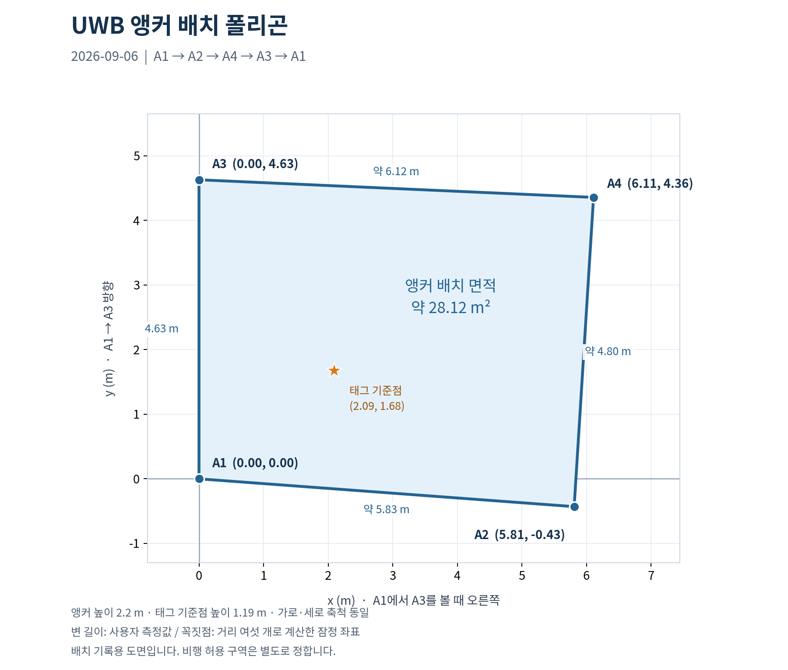

# UWB 앵커 실측값 — 2026-09-06 이력
이 문서는 9월 6일 배치의 실측값 사전이다.
과거 정지 기록을 재생하거나 당시 결과를 대조할 때 읽는다.

현재 기본값은 [6.3×4.6m 직사각형](uwb_anchor_layout.md)이다.
아래의 현재·새 배치 표현은 9월 6일 당시 기준이다.
과거 좌표 파일과 시험 근거는 보존한다.

## 2026-09-06 배치

**현재 앵커는 불규칙하게 배치되어 있다.**
2026-09-06 사용자가 반복 확인했다.
직사각형과 직각을 가정하지 않는다.
이유: 실제 설치 거리와 기존 배치가 다르다.

앵커 높이는 4기 모두 바닥 기준 2.2m다.
같은 높이에서는 앵커 사이 거리가 수평 거리다.
아래 값은 사용자 보고이며 독립 재측정은 하지 않았다.

## 앵커 사이 거리

보고된 거리를 좌표 성분으로 바꾸어 쓰지 않는다.
이유: 같은 거리에도 서로 다른 방향이 가능하다.

| 앵커 쌍 | 거리 | 확인 상태 |
|---|---:|---|
| A1 ↔ A2 | 약 5.83m | 사용자 보고 |
| A1 ↔ A3 | 4.63m | 사용자 보고 |
| A1 ↔ A4 | 7.50m | 사용자 보고 |
| A2 ↔ A3 | 7.70m | 사용자 보고 |
| A3 ↔ A4 | 6.12m | 사용자 보고 |
| A2 ↔ A4 | 약 4.80m | 사용자 보고. 여섯 거리 수집 완료 |

## 좌표 확인 상태

A1을 원점으로 삼는다.
사용자가 A3를 (0m, 4.63m)로 명시했다.
A2는 우측, A4는 우상단이라고 사용자가 확인했다.
A1에서 A3를 볼 때 오른쪽을 +x로 삼는다.
아래 값은 여섯 거리를 함께 맞춘 잠정 좌표다.
태그 설정 반영과 독립 검증은 아직 하지 않았다.

| 앵커 | x (m) | y (m) | z (m) | 상태 |
|---|---:|---:|---:|---|
| A1 | 0 | 0 | 2.2 | 사용자 기준 |
| A2 | 약 5.810 | 약 -0.430 | 2.2 | 거리로 계산. 우측 확인 |
| A3 | 0 | 4.630 | 2.2 | 사용자 기준 |
| A4 | 약 6.110 | 약 4.357 | 2.2 | 거리로 계산. 우상단 확인 |

A2와 A4의 계산은 직사각형을 가정하지 않는다.
원점 A1과 A3=(0m, 4.63m)는 고정했다.
나머지 거리 차이의 제곱 합을 최소로 맞췄다.
측정별 불확실성을 몰라 같은 가중치를 사용했다.

```text
+y 방향 = A1 → A3
+y 방향을 볼 때 오른쪽 = +x 방향
```

거리만으로 x의 부호를 구분할 수 없다.
이번 사용자 방향 확인으로 양수 후보를 선택했다.
A2는 계산상 A1보다 약 43cm 뒤쪽이다.
따라서 A1에서 A2로 향하는 선은 x축이 아니다.

```text
 +y (A3 방향)
 ^
 A3 (0, 4.63)
 |                                A4 (6.11, 4.36)
 |
 A1 (0, 0) --------------------------------> +x (오른쪽)
                                A2 (5.81, -0.43)
```

그림은 방향 설명용이다. 길이는 좌표 표를 따른다.

다섯 거리로 예상한 A2↔A4는 약 4.771m였다.
후속 보고 4.80m와 약 2.9cm 차이가 났다.

| A1·A3 기준선에 대한 A2·A4의 위치 | 다섯 거리로 예상한 A2↔A4 |
|---|---:|
| 같은 쪽 | 약 4.771m |
| 서로 반대쪽 | 약 12.844m |

예상값은 새 실측값을 대신하지 않는다.
거리들은 사용자 근사값이며 측정 오차는 미확인이다.

## 앵커 배치 폴리곤

**A1 → A2 → A4 → A3 → A1 순서로 기록했다.**
위 잠정 좌표로 만든 수평 배치 도면이다.
꼭짓점 순서는 반시계 방향이다.
각 변은 서로 교차하지 않는다.

| 기록 항목 | 값 |
|---|---|
| 좌표 기준 | A1 원점. +y는 A3 방향 |
| 수평 면적 | 약 28.12㎡ |
| 둘레 | 약 21.37m |
| 태그 기준점 | x=2.09m, y=1.68m |
| 앵커 높이 | 4기 모두 2.2m. 설치 정보 |
| 장치 적용 | 없음. 배치 기록만 저장 |

면적과 둘레는 잠정 좌표에서 계산한 값이다.
안전 비행 면적이나 UWB 수신 범위를 뜻하지 않는다.
이유: 벽과 장애물, 전파 가림은 별도 확인 사항이다.
비행 허용 구역을 정할 때 이 배치도를 참고한다.
그때 벽·랙 위치와 기체 크기, 위치 오차를 반영한다.



| 파일 | 용도 |
|---|---|
| [PNG 도면](../report/evidence/uwb_static_20260906_161636/anchor_polygon.png) | 배치 확인과 보고서 첨부 |
| [SVG 도면](../report/evidence/uwb_static_20260906_161636/anchor_polygon.svg) | 확대와 인쇄 |
| [꼭짓점 데이터](../report/evidence/uwb_static_20260906_161636/anchor_polygon.json) | 좌표·연결 순서·출처 보관 |

JSON 좌표의 단위는 m다. 위도·경도가 아니다.
닫힌 좌표 목록은 마지막에 A1을 한 번 더 둔다.
이 파일은 PX4나 태그의 실행 설정이 아니다.

## 여섯 거리의 일관성

전체 거리를 맞춘 후보는 입력값과 최대 약 0.5cm 차이다.
이 값은 설치 좌표의 정확도를 보증하지 않는다.
이유: 보고된 거리 자체의 측정 오차는 미확인이다.

| 앵커 쌍 | 사용자 거리 | 후보 좌표로 계산한 거리 |
|---|---:|---:|
| A1 ↔ A2 | 5.83m | 약 5.826m |
| A1 ↔ A3 | 4.63m | 4.630m. 기준선으로 고정 |
| A1 ↔ A4 | 7.50m | 약 7.505m |
| A2 ↔ A3 | 7.70m | 약 7.705m |
| A3 ↔ A4 | 6.12m | 약 6.116m |
| A2 ↔ A4 | 4.80m | 약 4.797m |

앵커의 좌우 확인은 완료했다.
태그 기준점도 같은 축으로 쟀다고 사용자가 확인했다.
거리 측정 도구와 안테나 기준점도 확인해야 한다.

## 기존 좌표와의 차이

기존 문서와 태그 출력은 현재 설치 기준과 다르다.
5×4.5m 직사각형은 기존 설정 이력이다.
현재 설치 배치로 재사용하지 않는다.
이유: 2026-09-06 실측 보고와 맞지 않는다.

| 항목 | 기존 기준 | 현재 판단 |
|---|---|---|
| A2 | (5m, 0m) | 실측 기반 약 (5.810m, -0.430m) |
| A3 | (0m, 4.5m) | 사용자 보고 (0m, 4.63m) |
| A4 | (5m, 4.5m) | 실측 기반 약 (6.110m, 4.357m) |
| 태그 배치 ID | warehouse-5x4p5-z2p2-v2 | 60초 수신 로그에서 확인 |
| A2=(0m, 5.83m) 초기 보고 | 좌표 보고 | 후속 거리와 우측 확인으로 대체 |
| 5.83×4.63m 직사각형 가정 | 대화 중 제안 | 사용자 확인으로 폐기 |

A2=(0m, 5.83m)라면 A2↔A3는 1.20m다.
보고된 7.70m와 맞지 않는다.
따라서 5.83m를 A2의 y 성분으로 확정하지 않는다.

## 기준점 시험과의 관계

기존 좌표의 단순 차이를 확정 정확도로 해석하지 않는다.
태그 기준점의 축은 사용자 회신으로 확인했다.
새 배치로 재계산한 평균과 기준점은 약 19.9cm 차이다.

| 항목 | 값 | 출처·한계 |
|---|---|---|
| 태그 기준점 | x=209cm, y=168cm, z=119cm | 사용자 보고. x·y 좌표축 확인 완료 |
| 태그 ↔ A2 실측 | 432cm | 사용자 후속 보고 |
| 태그 ↔ A2 수신 평균 | 약 459.3cm | 앞선 60초 수신 |
| 두 거리 차이 | 약 +27.3cm | 같은 태그 위치라는 전제 |
| 초기 x·y 단순 차이 | 약 87.1cm | 태그가 기존 앵커 배치로 계산한 값 |
| 새 배치로 재계산한 태그 평균 | x=193.3cm, y=180.2cm | 저장된 거리 2,533개. 새 측정 아님 |
| 새 평균과 기준점의 차이 | 약 19.9cm | 사용자 기준점과 비교. 독립 검증 아님 |

태그 기준점의 x는 기준선에서 직각으로 잰 거리다.
y는 A1에서 A3 방향으로 잰 거리다.
사용자는 이 기준으로 측정했다고 확인했다.
다음 단계는 위 앵커 좌표를 태그에 반영하는 일이다.
이후 같은 기준점에서 60초 정지 측정을 반복한다.
한 지점만으로 고정 거리 교정값을 정하지 않는다.
이유: 위치에 따라 거리 차이의 원인이 달라질 수 있다.

## 같은 기준점의 반복 측정

두 번째 60초 시험에서도 기존 태그 배치를 확인했다.
태그 출력은 이전 5×4.5m 계산과 일치했다.
아래 값은 모두 새 앵커 배치로 재계산한 결과다.

| 시험 | 재계산 평균 x, y | 기준점과 평균의 수평 차이 | 관측 조건 |
|---|---|---:|---|
| 16:16:37 시작 | 193.3cm, 180.2cm | 약 19.9cm | 첫 정지 측정 |
| 17:09:39 시작 | 191.5cm, 185.0cm | 약 24.4cm | 사람·물체 가림 보고 포함 |

두 번째 시험은 2,540회, 약 42.34Hz였다.
번호 누락은 없었다. 최대 간격은 약 61.5ms였다.
A4는 약 17~19초 구간에 최대 6.21m를 기록했다.
사용자는 해당 구간의 가림을 확인했다.
그 구간도 태그는 거리와 좌표를 정상으로 표시했다.
원시 거리만으로 값의 정확도까지 보증하지 않는다.
이유: 수신에 성공해도 가림으로 거리가 튈 수 있다.

가림 구간을 제거하지 않고 전체 통계에 포함했다.
새 좌표를 태그에 반영한 뒤 정지 측정을 반복한다.
가림 없는 시험과 가림 시험은 따로 기록한다.

두 번째 기록은 [반복 측정 결과](../report/evidence/uwb_static_20260906_170938/result.md)에 있다.
첫 측정 기록은 [60초 시험 결과](../report/evidence/uwb_static_20260906_161636/result.md)에 있다.
원문 회신은 [후속 실측 기록](../report/evidence/uwb_static_20260906_161636/manual_checks.json)에 있다.
현재까지 펌웨어와 PX4 설정은 변경하지 않았다.
