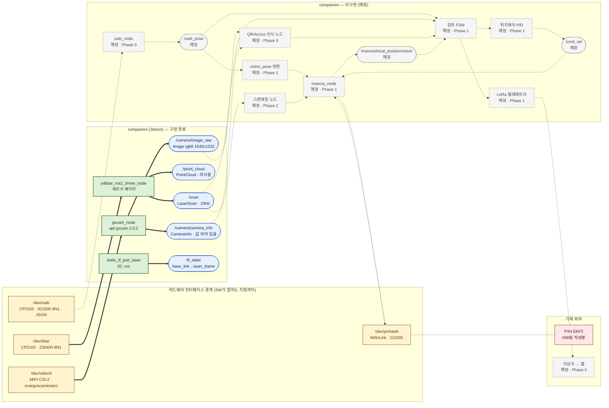
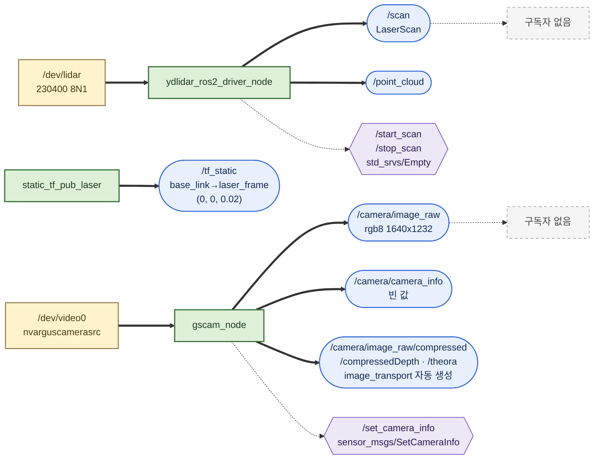
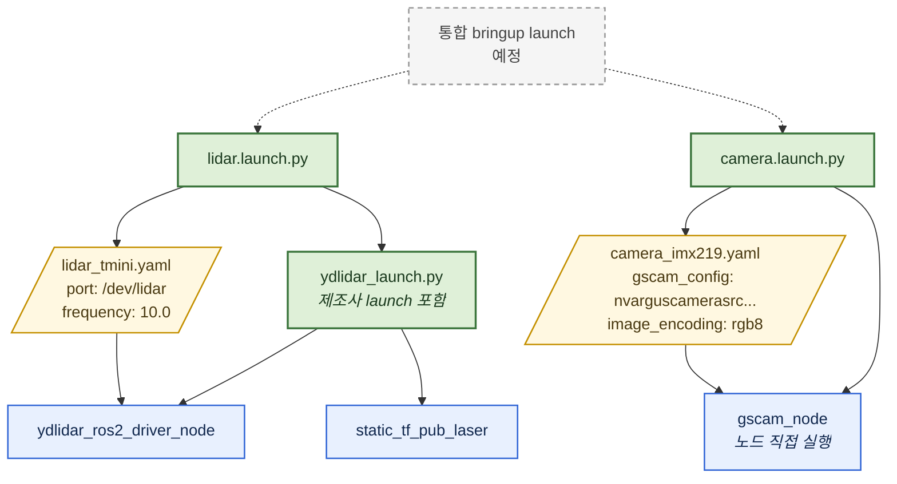
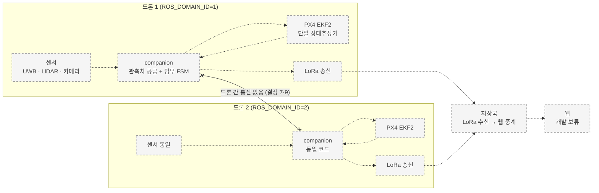

# SW 아키텍처 (현재 구현 기준)

> 이 문서는 **2026-08-16 시점에 실제로 도는 것**을 그린 구조도다.
> 계획도가 아니다. 미구현은 점선 + "예정"으로 구분해 표시한다.
> 기준 커밋 `7438c17`. 실행 확인 근거: [evidence/10_node_graph.txt](evidence/10_node_graph.txt)

---

## 결론 3줄

```text
1. 구현된 데이터 경로 2개 — LiDAR → /scan, CSI 카메라 → /camera/image_raw.
2. 두 경로는 서로 연결되지 않는다. 소비하는 노드가 아직 없기 때문이다.
3. 자체 작성 노드 0개. 실행 중인 노드 3개는 전부 외부 패키지다.
```

**하드웨어 표기 범위**: SW가 접하는 인터페이스 경계(디바이스 노드 / 시리얼 파라미터 / MAVLink)까지만.
센서 내부 동작·배선·기구부는 HW팀 작성분이라 그리지 않는다.

---

## 1. 전체 구조



범례:

| 표기 | 뜻 |
|---|---|
| 굵은 실선 (`==>`) | 실행 확인된 데이터 흐름 |
| 점선 (`-.->`) | 미구현. "예정" 표기 |
| 초록 상자 | 동작 중인 노드 |
| 파란 캡슐 | 발행 중인 토픽 |
| 회색 점선 상자 | 미구현 노드·토픽 |
| 노란 상자 | 하드웨어 인터페이스 경계 |
| 붉은 상자 | 기체 외부 / 타 팀 소관 |

---

## 2. 구현된 부분만 확대

현재 실제로 도는 것은 이것뿐이다.



**두 경로가 만나지 않는 것이 현재 구조의 핵심 특징이다.** 센서 데이터를 받는 노드가 없어
`/scan`과 `/camera/image_raw`의 구독자 수는 0이다
(`ros2 topic info /scan --verbose` → `Subscription count: 0`, [evidence/04_lidar_launch.txt](evidence/04_lidar_launch.txt)).

---

## 3. 기동 구성 (launch 관점)



| launch | 파일 | 커밋 |
|---|---|---|
| lidar.launch.py | [src/drone_bringup/launch/lidar.launch.py](../../src/drone_bringup/launch/lidar.launch.py) | `bf3c96d` |
| camera.launch.py | [src/drone_bringup/launch/camera.launch.py](../../src/drone_bringup/launch/camera.launch.py) | `3f7f136` |

두 launch를 한 번에 띄우는 통합 launch는 **미작성**이다.

---

## 4. 목표 구조 (Phase 4 완료 시) — 참고용

현재와의 거리를 보이기 위한 계획도다. **전 요소가 미구현**이므로 전부 점선으로 그린다.



두 드론 사이의 `x-.-x`는 **통신 없음**을 뜻한다 (roadmap 결정 7, 9).
격리는 `ROS_DOMAIN_ID`로만 하며 토픽 네임스페이스 접두어는 도입하지 않는다.

---

## 5. 구조상 확정된 제약

코드를 쓸 때 지켜야 하는 경계다. 각 항목에 이유를 붙인다.

| 제약 | 이유 | 근거 |
|---|---|---|
| companion에 비행용 위치 추정기 금지 | 공분산 이중 계상(과신) / 정보 순환 / 고장 책임 분리 불가 | [roadmap.md:44-51](../roadmap.md#L44-L51) |
| `odom→base_link` TF는 형식 변환만 | 재추정하면 위와 같은 문제가 생김 | roadmap.md:49-50 |
| `map→odom` 발행자는 항상 1개 | Phase 2에서 SLAM 패키지와 충돌 | roadmap.md:51 |
| companion에서 z 제어 금지 | 고도는 TFmini Plus + PX4 EKF 담당 | [altitude_policy.md:3](../altitude_policy.md#L3) |
| 좌표축 변환을 노드에서 하지 않음 | MAVROS가 ENU↔NED를 이미 변환. 두 번 뒤집으면 축이 반대로 감 | [uwb_node_design.md:229](../uwb_node_design.md#L229) |
| 제조사 코드(`ydlidar_ros2_driver`) 수정 금지 | 새 버전과 충돌 + 별도 저장소라 우리 수정이 기록되지 않음 | [README.md:25-27](../../README.md#L25-L27) |
| `/scan` 등 대용량 토픽의 LoRa 송신 금지 | LoRa는 수 kbps 저대역폭 | [roadmap.md:71-72](../roadmap.md#L71-L72) |
| 토픽 네임스페이스 접두어 도입 금지 | 격리는 `ROS_DOMAIN_ID`로 충분. 두 드론의 ROS2는 서로 불가시 | roadmap.md:23, 결정 7 |
| USB 잭 위치 고정 | LiDAR·UWB가 같은 CP2102에 같은 serial `0001`. udev가 포트 위치로만 구분 | [config/udev/99-dronestock.rules:15-32](../../config/udev/99-dronestock.rules#L15-L32) |

`camera/` 접두어에 대한 주의: 이것은 **센서 묶음 이름이지 드론 구분 접두어가 아니다.**
gscam이 스스로 `camera/` 아래에 발행하며, 군집 격리 규칙과 무관하다
([camera.launch.py:10-15](../../src/drone_bringup/launch/camera.launch.py#L10-L15)).

---

## 6. 다이어그램의 근거

| 다이어그램 요소 | 확인 방법 | 증빙 |
|---|---|---|
| 노드 3개 | `ros2 node list` | [evidence/10_node_graph.txt](evidence/10_node_graph.txt) |
| 토픽 및 타입 | `ros2 topic list -t` | 동일 |
| 노드별 발행/구독 | `ros2 node info` | 동일 |
| 서비스 | `ros2 service list` | 동일 |
| 구독자 0 | `ros2 topic info /scan --verbose` | [evidence/04_lidar_launch.txt](evidence/04_lidar_launch.txt) |
| TF 값 (0, 0, 0.02) | launch 기동 로그 | 동일 |
| 미구현 노드 목록 | `ls src/`, grep 전수 | [evidence/06_uwb_fail.txt](evidence/06_uwb_fail.txt), [evidence/08_qr_marker_fail.txt](evidence/08_qr_marker_fail.txt), [evidence/09_comm.txt](evidence/09_comm.txt) |
| 시리얼 파라미터 | udev 규칙 파일 | [config/udev/99-dronestock.rules](../../config/udev/99-dronestock.rules) |
