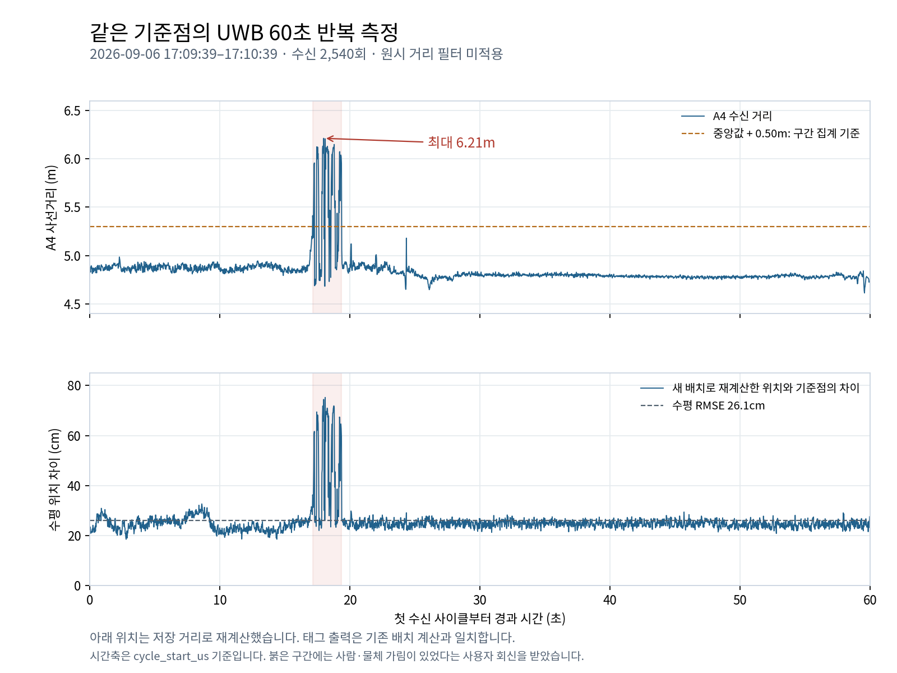

# UWB 같은 기준점 60초 반복 측정
이 문서는 두 번째 정지 시험의 측정 기록이다.
기존 시험 비교와 가림 구간 확인 때 읽는다.

태그 출력은 기존 5×4.5m 배치 계산과 일치한다.
새 배치로 재계산한 평균 차이는 24.4cm다.
A4 거리는 약 17~19초 구간에 크게 튀었다.
사용자는 그때 사람·물체의 가림이 있었다고 답했다.
측정값을 제거하거나 장치 설정을 바꾸지 않았다.

## 측정 조건

같은 기준점에서 60초 수신을 완료했다.

| 항목 | 기록 |
|---|---|
| 시작 | 2026-09-06T17:09:38.978226+09:00 |
| 종료 | 2026-09-06T17:10:39.039814+09:00 |
| 수집 시간 | 60.001초 |
| 태그 기준점 | x=2.09m, y=1.68m, z=1.19m |
| 좌표축 | A1 원점. +y는 A3 방향. +x는 오른쪽 |
| 기준점 근거 | 사용자 보고. x·y 축 확인 완료 |
| 앵커 높이 | 4기 모두 2.2m. 사용자 보고 |
| 앵커 배치 | [실측값](../../../uwb_anchor_survey.md)과 폴리곤 |
| 태그 | ID 5. uwb-tag-for-jetson-v1.8-raw-xy |
| 수신 포트 | /dev/uwb → /dev/ttyUSB0. 921600 baud |
| 장치 명령 전송 | 0바이트 |
| 호스트 수신 설정 | 측정 후 원래 설정으로 복원 |

측정 도구와 안테나 기준점은 독립 검증하지 않았다.
원시 수신 바이트와 호스트 수신 시각을 보존했다.
첫 불완전 줄 1개는 정상 JSON 집계에서 제외했다.
해당 바이트는 원본에 그대로 남아 있다.

## 태그의 앵커 배치 확인

태그가 내보내는 좌표는 기존 배치 계산과 맞는다.

| 근거 | 확인값 |
|---|---|
| 상태 메시지의 배치 ID | `warehouse-5x4p5-z2p2-v2` |
| 상태 메시지 수 | 12개. 배치 ID 동일 |
| 기존 배치로 검산한 사이클 | 2,540개 |
| 태그 출력과 검산의 최대 축 차이 | 0.1mm 미만 |
| 새 실측 배치 반영 여부 | 수신 결과에서 반영을 확인하지 못함 |

검산 차이는 계산식 일치 여부를 보는 값이다.
실제 위치 정확도가 0.1mm라는 뜻이 아니다.
펌웨어 소스와 저장 좌표를 직접 읽지는 않았다.
배치 ID와 거리·좌표 검산으로 기존 설정을 판단했다.

## 같은 기준점의 위치 비교

새 배치로 재계산한 평균은 기준점과 24.4cm 차이다.
아래 재계산에는 거리 필터를 적용하지 않았다.

| 항목 | x | y | 기준점과 평균의 수평 차이 |
|---|---:|---:|---:|
| 사용자 기준점 | 209.0cm | 168.0cm | — |
| 이번 태그 출력 평균 | 119.7cm | 180.0cm | 90.1cm |
| 이번 새 배치 재계산 평균 | 191.5cm | 185.0cm | 24.4cm |
| 이전 새 배치 재계산 평균 | 193.3cm | 180.2cm | 19.9cm |

| 이번 새 배치 재계산 지표 | 값 |
|---|---:|
| 수평 RMSE | 26.1cm |
| 수평 차이 p95 | 28.7cm |
| 수평 최대 차이 | 75.2cm |
| x 표준편차 | 6.3cm |
| y 표준편차 | 6.9cm |

재계산 좌표는 저장 거리에서 만든 분석 결과다.
태그에 새 좌표를 적용한 결과는 아니다.
가림 구간도 모든 통계에 포함했다.
한 지점의 결과를 전체 구역 정확도로 확대하지 않는다.
이유: 위치와 가림 조건에 따라 거리 특성이 달라진다.

## 수신 주기와 공백

번호 누락은 없지만 길어진 사이클과 재시도는 있었다.

| 항목 | 값 |
|---|---:|
| 거리 사이클 | 2,540회 |
| x·y 계산 성공 | 2,540/2,540 |
| 4개 앵커 모두 최종 거리 성공 | 2,540/2,540 |
| 측정 사이클 주기 | 42.34Hz |
| 수신 번호 누락 | 0 |
| 사이클 간격 중앙값 | 22.257ms |
| 사이클 최대 간격 | 61.523ms |
| 중앙값 2배 초과 간격 | 25회. 기준 44.514ms |
| 두 번째 시도 횟수 | A1 13회, A2 9회, A3 10회, A4 9회 |

최종 성공 표시는 정확한 거리임을 보증하지 않는다.
이번 A4 급증 구간도 실패 값은 모두 `ok`였다.
`raw_xy_valid=true`는 좌표 계산 성공을 뜻한다.
정확도가 검증됐다는 의미로 사용하지 않는다.

시간 간격은 `cycle_start_us`로 계산했다.
`sample_time_us`는 Report 읽기 직후 시각이다.
정확한 측정 시각이나 동기화된 시각이 아니다.

## 앵커별 거리 비교

거리 차이는 단일 지점의 비교값으로 기록한다.
예상 거리는 새 앵커 좌표와 기준점으로 계산했다.

| 앵커 | 좌표상 예상 거리 | 수신 평균 | 평균 − 예상 | 표준편차 |
|---|---:|---:|---:|---:|
| A1 | 286.5cm | 270.1cm | -16.4cm | 2.6cm |
| A2 | 439.5cm | 460.1cm | +20.6cm | 2.8cm |
| A3 | 375.4cm | 349.2cm | -26.2cm | 1.2cm |
| A4 | 493.5cm | 484.7cm | -8.8cm | 17.7cm |

이 차이를 곧바로 고정 교정값으로 적용하지 않는다.
이유: 설치 좌표와 가림의 영향도 포함될 수 있다.

## A4 가림 구간

사람·물체 가림 보고와 A4 거리 급증이 겹친다.
최초 수신 사이클 기준 약 17.14~19.36초 구간이다.
사용자 회신은 별도 시각 계측을 동반하지 않았다.

| 항목 | 값 |
|---|---|
| 사용자 회신 | 사람·물체가 지나가거나 가렸어요 |
| A4 거리 중앙값 | 4.802m |
| A4 최대 거리 | 6.213m |
| 최대값 수신 시각 | 17:09:56.992 KST |
| 구간 집계 기준 | 중앙값보다 0.50m 초과. 약 5.302m |
| 기준을 넘은 샘플 | 63회. 전체의 2.48% |
| 급증 샘플의 상태 | 모두 `ok`, 첫 시도 성공 |
| 분석에서 제거한 샘플 | 0개 |

0.50m는 이번 구간을 설명하는 집계 기준이다.
운용용 이상치 제거 문턱으로 정한 값이 아니다.
가림이 원인 중 하나일 가능성을 뒷받침한다.
전파 경로나 다른 영향은 로그만으로 확정하지 않는다.

## 다음 검증

새 앵커 좌표를 태그에 반영하는 단계가 먼저다.
그 뒤 가림 없는 정지 측정과 가림 시험을 나눈다.
거리 교정값은 여러 기준점에서 비교한 뒤 결정한다.

| 순서 | 확인할 내용 |
|---|---|
| 1 | HW 태그 코드에 실측 앵커 좌표 반영 |
| 2 | 배치 ID와 거리·x·y 계산 일치 확인 |
| 3 | 같은 기준점에서 가림 없는 60초 측정 |
| 4 | 가림 시작·종료를 기록한 별도 시험 |
| 5 | 다른 기준점에서도 거리 차이 비교 |

## 보관 파일

원본과 재계산 결과를 함께 보관한다.

| 파일 | 내용 |
|---|---|
| [serial.raw](serial.raw) | 원시 수신 바이트 |
| [received.jsonl](received.jsonl) | 호스트 시각과 JSON 메시지 |
| [metadata.json](metadata.json) | 측정 조건과 당시 참조 배치 |
| [unparsed.jsonl](unparsed.jsonl) | 첫 불완전 줄 기록 |
| [measurements.csv](measurements.csv) | 거리·태그 좌표·새 배치 재계산 |
| [summary.json](summary.json) | 통계와 이전 시험 비교 |
| [range_excursions.json](range_excursions.json) | A4 급증 구간과 사용자 가림 보고 |
| [manual_checks.json](manual_checks.json) | 사용자 회신 원문 |
| [static_repeat.png](static_repeat.png) | 거리와 위치 차이의 시간 변화 |
| [sha256.json](sha256.json) | 파일 해시 |
