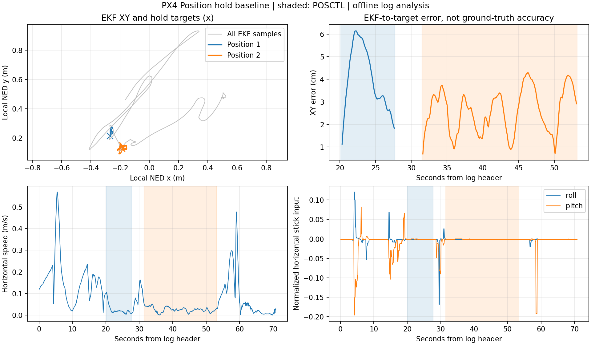

# 9월 27일 Position 위치 유지 로그 확인
이 문서는 새 ULog의 수평 위치 유지 확인 기록이다.
제어 업데이트 전후의 성능을 비교할 때 읽는다.

## 결론

**Position 모드의 수평 위치 유지 동작을 확인했다.**
두 구간의 합은 29.28초다.
각 구간에서 수평 목표가 고정돼 있었다.
수평 스틱도 거의 중립이었다.
따라서 모드 진입 이상의 동작 근거가 있다.

사용자는 수평이동제어가 상당히 진행됐다고 알렸다.
후속 제어 업데이트는 기다린다.
이번 로그를 그 업데이트의 비교 기준으로 남긴다.
후속 제공된 `perfect_holdv2.params`도 보관했다.
공통 파라미터 990개 중 11개가 다르다.
[설정 비교](perfect_holdv2_20260927.md)를 함께 읽는다.

| 확인한 것 | 이번 로그로 확정하지 않는 것 |
|---|---|
| PX4 자체 Position 위치 유지 | ROS 2 경유지 이동 완료 |
| EKF 추정 위치와 목표 사이 차이 | 외부 실측 위치 정확도 |
| 광학흐름·하방 거리 융합 | UWB 외부 위치 융합 |
| RC 기반 Position 모드 두 구간 | Offboard·자동 Hold 모드 시험 |

## 입력과 환경

파일 내부 정보로 버전과 실행 환경을 확인했다.
기체 번호·시험 장소는 아직 확인하지 못했다.

| 항목 | 값 |
|---|---|
| 원본 | [log_23_2026-9-27-13-34-50.ulg](../../log_23_2026-9-27-13-34-50.ulg) |
| 기록 길이 | 70.908608초 |
| PX4 버전 | v1.17.0 |
| 펌웨어 커밋 | `d6f12ad1c4f70ad3230afd7d86e971421e02fef4` |
| 하드웨어·OS | `PX4_FMU_V6C`·`NuttX` |
| `SYS_HITL` | 0 |
| 기록된 ULog dropout | 0개 |
| 분석기 | PX4 공식 pyulog |
| pyulog 커밋 | `ffbe3755d903e93797a89fb4fce26e0c0420a42f` |

실물 FC 실행 정보가 들어 있다.
이 정보만으로 1호기 시험이라고 확정하지 않는다.
센서 모델도 사용자 확인을 기다린다.

원본 SHA256:
`896a3f021f0b2eb9fd943e7960e2add8dfff67bcfe15541c442fac175146690f`

시간은 파일 헤더 시작을 0초로 삼았다.
파일명 시각을 비행 시작으로 가정하지 않았다.
초기 상태 표본은 0초보다 앞설 수 있다.
이는 기록 시작 전에 발행된 보관 표본이다.
초기 표본을 실제 상태 전환 사건으로 세지 않는다.

## 모드와 위치 유지 수치

두 Position 구간에서 목표 대비 편차가 작았다.
오차는 EKF 추정 XY와 제어 목표 XY의 차이다.
외부 기준 위치와 비교한 오차가 아니다.

| 로그 상대시간 | 모드 | 지속시간 |
|---|---|---:|
| 0.03~20.12초 | Altitude (`ALTCTL`) | 약 20.10초 |
| 20.12~27.69초 | Position (`POSCTL`) | 7.56초 |
| 27.69~31.48초 | Altitude | 3.80초 |
| 31.48~53.20초 | Position | 21.72초 |
| 53.20~70.91초 | Altitude | 17.71초 |

첫 0.03초에는 `vehicle_status` 표본이 없다.
`POSCTL=2`, `AUTO_LOITER=4`, `OFFBOARD=14`다.
번호는 [동일 펌웨어의 정의][status]로 확인했다.
이번 기록에는 4와 14가 없다.

| 지표 | Position 1 | Position 2 |
|---|---:|---:|
| 계산 표본 / 해당 구간 위치 표본 | 74 / 75 | 216 / 217 |
| XY 추종 오차 RMS | 4.26cm | 2.76cm |
| XY 추종 오차 p95 | 6.05cm | 4.10cm |
| XY 추종 오차 최대 | 6.14cm | 4.30cm |
| 수평 속도 평균 | 0.0224m/s | 0.0253m/s |
| 수평 속도 p95 | 0.0663m/s | 0.0430m/s |
| 고정 목표 x·y | −0.2705, 0.2148m | −0.1883, 0.1270m |
| 수평 스틱 절댓값 최대 | 0.00201 | 0.00201 |
| XY·수평 속도·방향 reset 횟수 증가 | 0회 | 0회 |

좌표는 로그의 local NED를 그대로 썼다.
두 목표를 자동 순회한 기록은 아니다.
사이에 Altitude 조작 구간이 들어 있다.

## 계산 조건과 한계

과거 표본만 연결해 목표와 위치를 비교했다.
선형 보간으로 미래 목표를 섞지 않았다.

| 분석 조건 | 값·처리 |
|---|---|
| 위치 기준 표본 | `vehicle_local_position`, 약 10Hz 기록 |
| 목표 | `vehicle_local_position_setpoint` |
| 목표 최대 나이 | 0.25초 |
| RC 최대 나이 | 0.4초 |
| 모드·arm·착륙·제어 상태 최대 나이 | 1.5초 |
| 계산 대상 | Position·armed·공중·수평 위치제어 활성 |
| 위치·속도 | 유효한 XY·수평 속도만 사용 |
| 모드 경계 | 이전 모드 목표 제외. 구간당 1표본 제외 |
| 통계 가중치 | 기록 표본마다 동일 가중치 |
| hold 후보 | 목표 변화폭 ≤1mm, 수평 스틱 ≤0.05 |
| 후보 추가 조건 | 계산 표본 비율 ≥95%, RC 누락·reset 없음 |

위 값은 파일 분석용 조건이다.
기체 설정이나 비행 합격 기준으로 적용하지 않았다.
0.25초 연결은 발행 시각 기준이다.
센서 지연을 추정해 보정한 결과는 아니다.
기록 사이의 짧은 조작이나 흔들림은 놓칠 수 있다.
dropout 0개도 모든 센서의 무손실을 뜻하지 않는다.

## 상태추정과 장비 확인

위치 유지는 광학흐름과 거리 융합에 기반했다.
Position 구간의 선택된 EKF는 instance 0이다.

| 항목 | 관측 |
|---|---|
| `EKF2_OF_CTRL` | 1 |
| 광학흐름 융합 표본 | 1구간 15/15, 2구간 44/44 |
| 광학흐름 관측 기각 | 두 구간 모두 0개 |
| 광학흐름 test ratio 최대 | 0.00713 / 0.05090 |
| `EKF2_RNG_CTRL` | 1 |
| 거리 융합 표본 | 1구간 15/15, 2구간 43/43 |
| 거리 관측 기각 | 두 구간 모두 0개 |
| `EKF2_EV_CTRL`·`EKF2_GPS_CTRL` | 둘 다 0 |
| 외부 위치·GNSS 위치 융합 플래그 | 둘 다 비활성 |
| `xy_valid`·`v_xy_valid` | 위치 표본 709개 모두 true |
| `heading_good_for_control` | 위치 표본 709개 모두 false |
| `EKF2_HGT_REF` | 0. 거리 융합 활성과 별개 설정 |
| `SENS_EN_PMW3901` | 0 |
| `SENS_EN_TF02PRO` | 1 |

센서 모델은 드라이버 설정만으로 확정하지 않는다.
이유: 외부 전달이나 호환 드라이버일 수 있다.
광학흐름 `device_id=0`도 모델을 식별하지 못한다.
장비 문서의 미입고 항목을 자동 완료 처리하지 않았다.

`heading_good_for_control=false`는 후속 확인 항목이다.
같은 펌웨어에서 이 값은 최종 방향 정렬 완료를 뜻한다.
이번에는 `cs_yaw_align=1`이었다.
반면 `cs_mag_aligned_in_flight=0`이었다.
[발행 코드][ekf2]와 [판정 함수][ekf]로 의미를 확인했다.
Position 실패로 단정할 근거는 아니다.
UWB 원점·방향 연결 전에 별도로 확인한다.

## 종료 구간에서 확인할 점

자동 착륙 완료를 입증하는 종료 기록은 아니다.
착륙 미판정과 kill switch 사건이 남아 있다.

| 상대시간 | 기록 |
|---|---|
| 58.67초 | `ground_contact=true` |
| 60.33초 | `Disarming denied: not landed` |
| 62.64초 | `ground_contact=false` |
| 63.33초 | `Kill engaged` |
| 64.68초 | `Kill disengaged` |
| 64.89초 | `Kill engaged` |
| 69.91초 | `Disarmed by kill-switch` |
| 70.26초 | `landed=true` |

실제 지면 접촉 여부와 조종 의도는 미확인이다.
이 기록만으로 추락이나 센서 고장을 단정하지 않는다.
착륙 판정과 종료 절차는 HW 시험 담당자와 대조한다.
companion의 고도 제어를 추가하는 작업은 아니다.

## 이번 개선과 다음 확인

새 로그를 같은 방식으로 평가할 도구를 추가했다.
비행 제어기·게인·기체 파라미터는 변경하지 않았다.

| 순서 | 다음 확인 | 필요한 근거 |
|---|---|---|
| 1 | 이번 시험 조건 확정 | 기체 번호·센서 모델·종료 조작 설명 |
| 2 | 위치 유지 반복성 | 동일 조건의 후속 ULog |
| 3 | 목표 이동·감속·정지 | 제어 업데이트·목표 시각·목표 좌표·ULog |
| 4 | 도착 판정 개선 | 거리·속도·유지시간·위치 reset 기록 |
| 5 | 장애물·입력 공백 대응 | 정지거리·지연·공백을 넣은 가상 시험 |

이번 수치만으로 게인을 바꾸지 않는다.
이유: 외부 기준 위치와 반복 시험이 없기 때문이다.
광학흐름 기준 좌표의 누적 이동은 실측으로 확인한다.
자율 경로의 절대 좌표에는 UWB 연결 검증도 필요하다.

| 검증 | 결과 |
|---|---|
| 분석 도구 단위 시험 | 9개 통과 |
| 27일 ULog 실행·그림 확인 | 성공. Position 구간 2개 |
| 26일 ULog에도 실행 | 성공. 67.08초 기록에서 Altitude만 관측 |
| 새 실물 비행·SITL 재시험 | 미실시 |
| ROS 패키지 빌드 | 미실시. 독립 파일 분석 도구만 추가 |

[재실행 절차](../position_hold_audit_runbook.md)를 따른다.
[요약 JSON](evidence/position_hold_20260927/summary.json)에 설정·해시를 남겼다.
[연결 표본 CSV](evidence/position_hold_20260927/samples.csv)로 계산을 재검산할 수 있다.

[status]: https://github.com/PX4/PX4-Autopilot/blob/d6f12ad1c4f70ad3230afd7d86e971421e02fef4/msg/versioned/VehicleStatus.msg
[ekf2]: https://github.com/PX4/PX4-Autopilot/blob/d6f12ad1c4f70ad3230afd7d86e971421e02fef4/src/modules/ekf2/EKF2.cpp
[ekf]: https://github.com/PX4/PX4-Autopilot/blob/d6f12ad1c4f70ad3230afd7d86e971421e02fef4/src/modules/ekf2/EKF/ekf.h
