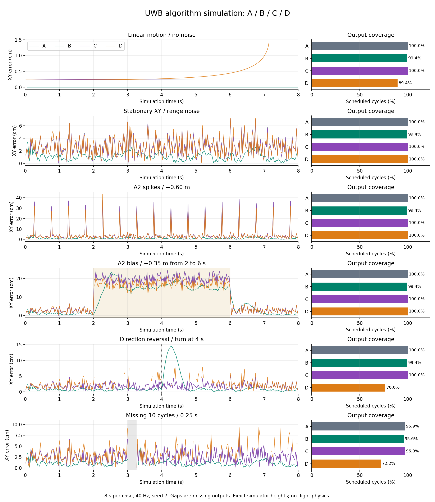
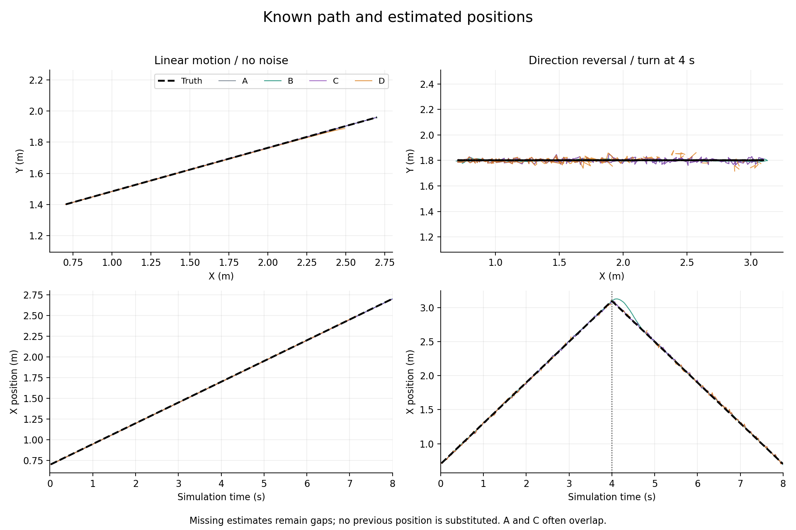

# C·D 시뮬레이터 실행 — 2026-09-27

UWB 합성 입력으로 A/B/C/D를 실행한 기록이다. 경로·오차·출력 누락을 비교할 때 읽는다.

## 결과

**여섯 상황, 총 1,920주기의 계산을 완료했다.**
C는 이번 조건에서 A와 비슷했다.
D는 스파이크·지속 편향에서 일부 오차가 작았다.
그러나 이동 중 교점 부재로 출력이 자주 끊겼다.
이 결과만으로 실운용 모델을 선정하지 않는다.

이번 실행은 저장소의 UWB 알고리즘 시뮬레이션이다.
Gazebo·PX4 SITL을 실행한 시험은 아니다.
기존 여섯 시나리오를 같은 seed로 다시 실행했다.
새 난수·새 시나리오의 독립 검증으로 세지 않는다.
이전 결과와 위치·요약 파일이 바이트 단위로 같았다.

## 입력과 실행 범위

알려진 경로에서 거리값을 만들고 오차를 주입했다.
이후 기존 A/B/C/D 함수로 위치를 계산했다.

```text
가상 XYZ 경로 + 앵커 지도
             ↓
앵커별 시각의 사거리 생성
             ↓
거리 편향·잡음·이상·단절 주입
             ↓
알려진 편향 차감 → A / B / C / D
                                  ↓
경로 기준값과 비교 → 오차·가용률·그래프
```

| 조건 | 적용값 |
|---|---|
| 시나리오 길이·주기 | 각각 8초, 40Hz, 320주기 |
| 난수 seed | 각 시나리오 7 |
| 앵커 지도 | `anchors_20260906.json` |
| 앵커 표본 시각 | 주기 시작 후 4/8/12/16ms |
| 위치 평가 시각 | 주기 시작 후 20ms |
| 높이 입력 | 경로의 `z=1.1+0.02t`를 표본별 제공 |
| 기본 거리 편향 | `[-0.14,+0.20,-0.17,-0.06]m`. 생성 후 정확히 차감 |
| 거리 잡음 표준편차 | 직선 0, 반전 0.02m, 나머지 0.03m |
| C/D 설정 | 기존 `uniform4` / `strict_uniform4` 유지 |
| ToF·자세 모델 | 미포함. 높이 생성값을 직접 제공 |
| 비행·외부 출력 | 미연결 |

정지 시나리오는 XY가 정지한다.
높이는 모든 시나리오에서 위 식으로 변한다.
편향 교정 오차·장착 오차·센서 시간 대응은 이번 범위 밖이다.
모든 조건은 [조건 파일](../../data/processed/uwb/subsets_simulation_20260927/simulation_conditions.json)에 있다.

| 시나리오 | 주입 조건 |
|---|---|
| 무잡음 직선 | X 0.25m/s, Y 0.07m/s |
| 정지 잡음 | XY=(0.7,1.8)m, 거리 잡음 |
| 거리 튐 | A2에 20주기마다 +0.60m |
| 지속 편향 | A2에 2~6초 동안 +0.35m |
| 방향 반전 | X 속도 +0.6m/s → 4초에 -0.6m/s |
| 단절 | 직선 이동 중 120~129번 주기 누락 |

## 오차와 출력률

오차 비교는 같은 시각의 유효 출력끼리 했다.
각 행의 A/C와 A/D는 표본 집합이 다를 수 있다.
두 비교의 RMSE를 가로질러 순위를 매기지 않는다.

| 시나리오 | A/C 공통 수 | A/C RMSE cm | A/D 공통 수 | A/D RMSE cm |
|---|---:|---:|---:|---:|
| 무잡음 직선 | 320 | 0.250 / 0.251 | 286 | 0.248 / 0.388 |
| 정지 잡음 | 320 | 2.983 / 2.979 | 320 | 2.983 / 3.009 |
| 거리 튐 | 320 | 8.316 / 8.290 | 320 | 8.316 / 7.513 |
| 지속 편향 | 320 | 14.234 / 14.032 | 320 | 14.234 / 12.464 |
| 방향 반전 | 320 | 2.039 / 2.039 | 245 | 2.033 / 2.986 |
| 단절 | 310 | 2.902 / 2.903 | 231 | 2.862 / 3.819 |

가용률은 예정된 320주기를 분모로 계산한다.
입력이 없는 10주기도 단절 시나리오 분모에 포함한다.
과거 위치로 빈 구간을 채우지 않았다.

| 시나리오 | A 출력 | B 출력 | C 출력 | D 출력 |
|---|---:|---:|---:|---:|
| 무잡음 직선 | 100.00% | 99.38% | 100.00% | 89.38% |
| 정지 잡음 | 100.00% | 99.38% | 100.00% | 100.00% |
| 거리 튐 | 100.00% | 99.38% | 100.00% | 100.00% |
| 지속 편향 | 100.00% | 99.38% | 100.00% | 100.00% |
| 방향 반전 | 100.00% | 99.38% | 100.00% | 76.56% |
| 단절 | 96.88% | 95.62% | 96.88% | 72.19% |

평균 편차 XY·표준편차 XY는
[진단 파일](../../data/processed/uwb/subsets_simulation_20260927/diagnostics.json)에 있다.
p95·최대 오차·A/B 비교·네 모델 공통 시각은
[전체 요약](../../data/processed/uwb/subsets_simulation_20260927/synthetic_summary.json)을 따른다.
평균 편차와 산포는 각 모델의 유효 출력 집합 기준이다.

## 그래프 해석

선이 끊긴 곳은 새 위치를 출력하지 못한 구간이다.
A는 회색, B는 초록, C는 보라, D는 주황이다.



B는 거리 튐에 강했지만 반전 직후 추종 오차가 커졌다.
C는 시간창을 쓰지 않아 그 지연이 나타나지 않았다.
다만 거리 잡음·편향을 크게 줄이지 못했다.
D는 무잡음 이동에서도 후반 출력이 끊겼다.
앵커별 측정 시각이 달라 원이 한 위치를 가리키지 않을 수 있다.



검은 점선은 가상 경로의 기준값이다.
A와 C의 궤적은 대부분 겹친다.
그림은 선택한 직선·반전 경로를 보여준다.
[오차 PDF](../../data/processed/uwb/subsets_simulation_20260927/simulation_errors.pdf)와
[경로 PDF](../../data/processed/uwb/subsets_simulation_20260927/simulation_paths.pdf)도 저장했다.

## 구현 변경과 확인

기존 모델을 바꾸지 않고 실행·시각화 도구를 추가했다.
실측 파일 없이 합성 시험만 따로 실행할 수 있다.

| 항목 | 확인 결과 |
|---|---|
| 새 도구 | `src/drone_uwb/tools/run_subset_simulation.py` |
| 사용한 계산 | 기존 `benchmark_subsets.simulate`와 A/B/C/D 함수 |
| 출력 | 위치 JSONL·요약·조건·설정·지도·진단·그림·해시 |
| 여섯 시나리오 실행 | 완료, 1,920주기 |
| C/D 관련 pytest | 28 passed, 7.35초 |
| 기존 동일 조건 결과와 대조 | 위치·요약 파일 바이트 일치 |
| 그림 검토 | 오차·누락·축·경로 표시 확인 |
| 패키지 재빌드 | 이번 미실시. 소스 실행 도구만 추가 |
| Gazebo·SITL·비행 | 미실시 |

[실행 manifest](../../data/processed/uwb/subsets_simulation_20260927/manifest.json)와
[검증 기록](../../data/processed/uwb/subsets_simulation_20260927/verification.json)에 근거를 남겼다.

재실행은 [자료 실행 절차](../uwb_data_runbook.md)의 합성 비교 명령을 따른다.
새 seed·여러 경로·높이 관측 오차·동적 실측은 후속 시험이다.
D 반지름 확장과 후보 가중치 변경도 이번에는 적용하지 않았다.


## 기능별 커밋 전 통합 확인

2026-09-27 최종 작업본으로 UWB 테스트 142개를 통과했다.
전체 5개 패키지 빌드와 새 CLI 두 개도 확인했다.
이전 시험 수치와 당시 검증 기록은 보존했다.
이번 실기·Gazebo 실행 검증은 미실시다.
[통합 확인 기록](uwb_commit_review_20260927.md)을 따른다.
