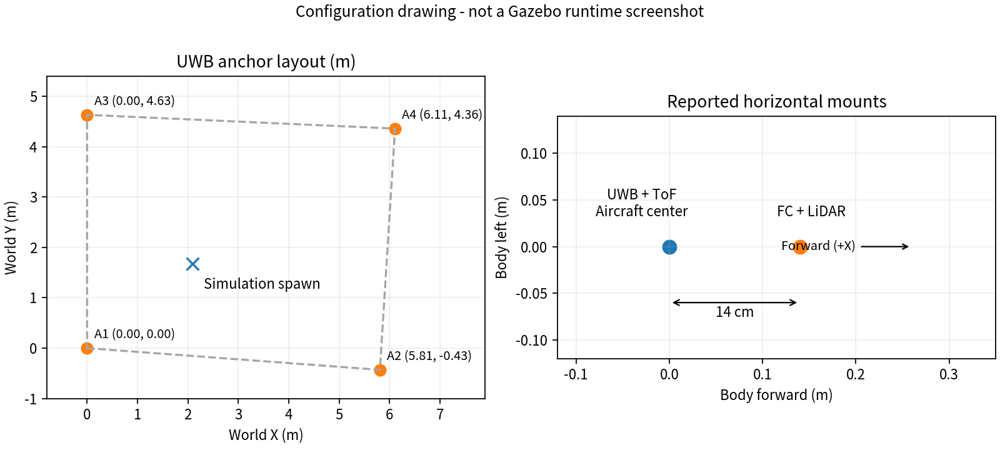

# UWB·탑재 장비 Gazebo 구성 결과

2026-09-27 장비 배치와 가상 센서 구성 기록이다. 모델을 WSL에 적용하기 전에 읽는다.

## 완료 범위

앵커 월드·센서 기체·가상 UWB 발행기를 준비했다.
수평 장착 위치는 이번 사용자 회신을 반영했다.
Gazebo가 없는 현재 작업공간에서는 실행 검증을 하지 못했다.

## 적용값과 출처

기체 중심을 가상 모델 좌표의 원점으로 사용한다.
기체 중심과 실제 질량중심의 일치는 미확인이다.
좌표는 앞 +x, 왼쪽 +y, 위 +z인 FLU다.

| 항목 | 반영값 | 근거·한계 |
|---|---|---|
| FC·IMU | x=+0.14m | 사용자 보고. 높이는 미확인 |
| UWB 안테나 | x=0, y=0 | 사용자 보고. FC보다 수평으로 0.14m 뒤 |
| ToF | x=0, y=0, 하향 | 사용자 보고. 높이는 미확인 |
| LiDAR | x=+0.14m | 사용자 보고. 높이·기울기는 미확인 |
| 실물 질량 | 대략 2kg 이하 | 정확한 질량으로 확정하지 않음 |
| 가상 총질량 | 2kg | 비교용 상한 근사값 |
| 관성·질량 분포 | 기존 링크 질량·관성을 같은 비율로 조정 | 실제 기체 동특성 재현 아님 |
| 카메라·광학흐름 장착 | 설정 파일의 시험값 | 이번 사용자 회신에 위치 없음 |

높이 시험값은 안테나 +0.30m, ToF -0.05m다.
LiDAR +0.08m, 카메라 +0.03m, 광학흐름 -0.10m도 시험값이다.
수평 위치 확인을 높이 확인으로 확대하지 않았다.
FC의 높이 기준은 이번 모델에서 0m로 두었다.

앵커는 `anchors_20260906.json`을 그대로 사용한다.
참고 ZIP의 다른 배치와 혼합하지 않는다.

| 앵커 | X(m) | Y(m) | Z(m) |
|---|---:|---:|---:|
| A1 | 0 | 0 | 2.2 |
| A2 | 5.810203 | -0.430327 | 2.2 |
| A3 | 0 | 4.630000 | 2.2 |
| A4 | 6.110227 | 4.357350 | 2.2 |

위도·경도상의 절대좌표가 아니라 기존 UWB 지도 좌표다.
여섯 거리로 구한 잠정값이며 독립 검증은 미실시다.
화면의 앵커와 거리 계산기가 같은 JSON을 사용한다.
시험 벽은 x=8m에 추가했다. 실제 창고 벽을 측량한 값은 아니다.

## 장비별 가상 구현

기능이 같은 센서를 사용하고 제조사 특성의 재현 범위를 구분한다.

| 실물 장비 | 적용한 가상 구성 | 남은 차이 |
|---|---|---|
| Pixhawk 6C Mini | PX4 SITL + x500 IMU·기압·자력계 | 보드 전기 특성·실측 IMU 오차 미반영 |
| DWM3000EVB·앵커 4기 | 앵커 표시 + 장착 위치 기하 + Gazebo 가상 RAW 발행 | RF·CIR·자동 장애물 NLOS 모델 없음 |
| TFmini Plus | PX4 하방 `gpu_lidar`, 0.1~12m, 100Hz | 단일 광선 근사. 반사 강도·시야각 전체 모사 아님 |
| PMW3901 | PX4 `optical_flow`와 `OpticalFlowSystem` | 칩 내부 처리·실측 장착·표면별 오차 미확인 |
| T-mini Pro | 수평 `gpu_lidar`, 360도, 0.02~12m, 10Hz | 720광선·0.01m 잡음은 시험값 |
| IMX219 카메라 | Gazebo camera, 640×480, 30Hz | 시험 시야각 1.2rad. 렌즈 교정값 아님 |
| Jetson | 현재 Python 계산 프로세스 | Orin Nano의 실행 지연·전력 재현 아님 |
| 모터·ESC·배터리 | x500의 모터 모델 유지 | XRotor·AM32·6S 배터리의 실측 곡선 미반영 |
| LoRa·QR 스캐너 | 이번 모델 범위에서 보류 | 통신 지연·임무 인식 시험 때 추가 |

TFmini 범위는 [제조사 자료](https://en.benewake.com/TFminiPlus/index.html),
T-mini 범위는 [제조사 자료](https://www.ydlidar.com/products/view/22.html)를 참고했다.
잡음·센서 주기·카메라 축소 해상도는 시험 설정이다.
센서가 켜져 있다는 사실만으로 실측 동등성을 판정하지 않는다.

## 찾은 플러그인과 선택 이유

현재 환경에서는 PX4에 포함된 센서를 먼저 조합했다.
[PX4 모델 저장소](https://github.com/PX4/PX4-gazebo-models/tree/bb0b9cf974acf4f1bcb5f5fcf80b88841562dea9/models)의
x500·하방 거리·광학흐름·2D LiDAR·카메라 소스를 확인했다.
사용자 PX4 커밋 `c4e4ef98e9`가 지정하는 모델 커밋이다.
WSL의 실제 서브모듈 상태는 별도 조회가 필요하다.

[UWBPX4Sim](https://github.com/amartinezsilva/UWBPX4Sim/tree/f71bab25aec7919116a1822dcb436108102d771f)은
Harmonic용 UWB 플러그인 후보로 확인했다.
README는 장애물·거리·편향·누락 모델을 설명한다.
`UWBGazeboSystem.cpp`와 CMake도 읽었다.
로봇·링크 이름 규칙과 앵커-태그 쌍 토픽을 사용한다.
거리 출력은 cm 단위 `gz.msgs.Double`이다.
확인한 발행 구문은 측정시각 헤더를 채우지 않는다.
빌드에는 `ament_cmake`와 PX4 메시지 의존성이 있다.
우리의 4앵커·m·측정시각 계약에 맞춘 이식이 필요하다.
이번에는 설치하지 않았으며 NLOS 확장 후보로 남겼다.

자체 RAW 발행기는 Gazebo Python 연결을 사용한다.
정답 위치는 가상 센서 생성에만 사용한다.
RAW 메시지와 정답 파일을 분리한다.
가림 효과는 현재 파일 시나리오에서 명시적으로 주입한다.
시험 벽을 추가했다고 UWB 전파 가림이 자동 적용되지는 않는다.

## 27일 로그의 추력 검토

로그에는 추력 명령과 호버 추력 추정값이 있다.
물리적인 N 단위 추력 측정값은 아니다.
실제 로그 펌웨어의
[메시지 정의](https://github.com/PX4/PX4-Autopilot/blob/d6f12ad1c4f70ad3230afd7d86e971421e02fef4/msg/VehicleThrustSetpoint.msg)도 확인했다.

| Position 모드 표본 | 개수 | 중앙값 | p05~p95 |
|---|---:|---:|---:|
| 추력 명령 벡터 크기 | 1,464 | 0.321029 | 0.316647~0.324156 |
| 유효한 호버 추력 추정 | 215 | 0.320891 | 0.319303~0.322168 |

초기 `MPC_THR_HOVER`는 0.35, `MPC_USE_HTE`는 1이다.
ESC 관련 토픽은 이 로그에서 찾지 못했다.
모터 추력·RPM 곡선이나 실제 최대 추력은 식별하지 못했다.
따라서 0.321을 모터 상수나 최대 추력으로 대입하지 않았다.
가상 호버링의 제어 출력과 비교할 참고값으로 보관한다.
원본 ULog와 실제 기체의 장착 상태가 같은지는 별도 확인이 필요하다.

[추력 검토 JSON](../../data/processed/uwb/gazebo_equipment_20260927/thrust_log_review.json)에
원본 해시·모드 선택 조건·모터별 출력도 기록했다.
재생 도구는 `src/drone_uwb/tools/audit_sim_thrust.py`다.
pyulog 1.2.4로 원본을 읽었으며 파라미터 적용은 하지 않았다.

## 사용자 WSL 연결 확인 추가

2026-09-27 사용자가 전달한 터미널 출력에 근거한다.
작업공간에서 WSL에 접속해 직접 실행한 검사는 아니다.

| 관찰 | 확인 범위 |
|---|---|
| `gz topic -l`에 `/world/default/dynamic_pose/info` 표시 | 기존 월드의 위치 토픽 이름 확인. 메시지 내용·주기는 미확인 |
| `x500_lidar_down_0`의 IMU·하방 거리·광학흐름·2D LiDAR 경로 표시 | 토픽 이름 확인. 센서별 실제 발행·연속 수신은 미확인 |
| `Node`, `Pose_V`, `numpy` 순서의 import에서 NumPy만 실패 | Gazebo 두 Python 모듈은 로딩 성공. 시스템 Python NumPy 누락 |
| 새 월드·기체 이름이 출력에 없음 | 새 앵커·장비 모델 적용 여부는 미확인 |
| `make -j2 px4_sitl gz_x500_lidar_down`에서 `PX4 server already running for instance 0` | 기존 0번 인스턴스와 중복 실행되어 시작 단계 중단. 이 출력에 컴파일 오류는 없음 |

조치는 WSL에서 `sudo apt install -y python3-numpy` 후 동일 import 재검사다.
패키지 목록 갱신과 재검사 명령은 [적용 절차](../uwb_gazebo_equipment_runbook.md)에 기록했다.
이 시점에는 설치·재검사 결과를 아직 받지 않았다.
이 결과로 새 모델의 플러그인 로드나 비행 검증 상태를 변경하지 않는다.

중복 실행에 대한 조치는 기존 실행을 유지하고 별도 Ubuntu 셸에서 NumPy 확인을 마치는 것이다.
재시작이 필요한 경우에만 기존 PX4 창에서 정상 종료한 뒤 한 번 실행한다.
관련 오류 설명을 [WSL 실행 절차](../gazebo_wsl_runbook.md)에 추가했다.
사용자 WSL에서 종료·재시작을 직접 실행하거나 성공 여부를 검증하지 않았다.

이어 받은 화면에서는 NumPy 설치·검사 명령 앞이 `PS C:\WINDOWS\system32>`였다.
Windows의 `sudo` 비활성화 안내와 `/usr/bin/python3` 명령 인식 오류가 표시됐다.
이는 Ubuntu에서 실행한 NumPy 설치 결과가 아니므로 당시 설치 상태는 미확인이었다.
먼저 PowerShell에서 `wsl -d Ubuntu-22.04`로 진입해 프롬프트를 확인하도록 안내한다.
Windows의 sudo 기능 활성화는 이 조치에 필요하지 않다.

왼쪽 PX4 로그 창도 마지막 줄이 PowerShell 프롬프트로 돌아온 모습이다.
따라서 이전 중복 실행 메시지로 현재 PX4가 계속 실행 중이라고 단정하지 않는다.
화면에는 IMU 시각 오류도 보이지만 원인·현재 프로세스 상태는 검증하지 않았다.
Ubuntu 진입과 의존성 검사를 마친 뒤 시뮬레이터 재실행 상태를 확인한다.
코드 변경은 없고 WSL 실행·장비 시험은 이 작업공간에서 미실시다.

그 뒤 사용자로부터 Ubuntu 프롬프트와 `sudo apt install -y python3-numpy` 출력을 받았다.
`python3-numpy` 버전 `1:1.21.5-1ubuntu22.04.1`의 다운로드·압축 해제·설정 완료와
Ubuntu 셸 복귀를 확인했다. 사용자 제공 출력 기준으로 패키지 설치는 성공했다.
다음 검사는 `/usr/bin/python3`에서 `Node`, `Pose_V`, `numpy`를 순서대로 불러오는 것이다.
이 시점에는 설치 후 모듈 로딩 결과를 아직 받지 않았다.

후속 사용자 출력에서 세 import 뒤 `Gazebo Python OK`가 표시됐다.
시스템 Python의 Gazebo 통신·메시지·NumPy 로딩 확인은 완료됐다.
센서 수신·새 모델 실행은 여전히 미확인이다.

다음 단계로 원격 작업공간의 장비 ZIP을 WSL로 복사하도록 안내했다.
작업공간에서 ZIP 파일 99개·250,177바이트·CRC 검사 통과를 재확인했다.
WSL의 복사·압축 해제·새 모델 설치는 아직 실행 결과를 받지 않았다.

후속 사용자 출력에서는 `scp` 전송이 100%로 완료됐다.
그러나 실행 프롬프트는 `pgyxn@user-desktop:~/github/ROS2$`였다.
해당 명령의 수신 위치는 원격 컴퓨터의 `~/uwb_sim/`이다.
이 출력은 `dronestock` WSL로의 전달 완료를 뜻하지 않는다.
Windows에서 WSL에 진입한 뒤 사용자·호스트를 먼저 확인하도록 안내했다.
원격 복사본 삭제나 사용자 WSL로의 추가 전송은 수행하지 않았다.

이후 `dronestock@DESKTOP-0C8GRSK`에서 실행한 명령 출력을 받았다.
`mkdir -p ~/uwb_sim` 후 `scp`가 100%로 완료됐다.
동일 Ubuntu 프롬프트로 복귀해 WSL로의 ZIP 전송을 확인했다.
이 확인은 사용자 출력에 근거하며 WSL에서 별도 해시 비교는 미실시다.
다음 단계는 Python ZIP 도구로 압축을 풀고 설정 파일을 확인하는 것이다.
이 시점에는 압축 해제·모델 설치·Gazebo 실행 결과를 아직 받지 않았다.

후속 사용자 출력에서 `~/uwb_sim/uwb-gazebo-equipment` 진입을 확인했다.
`ls src/drone_uwb/config`에 앵커·장비·비교 설정 세 파일이 표시됐다.
따라서 풀린 소스 폴더와 해당 설정 파일의 존재는 확인됐다.
이 시점에는 WSL의 전체 묶음 해시 비교나 모델 생성 결과가 없었다.
작업공간에서는 ZIP의 생성 코드·장비 설정·앵커 설정이 현재 소스와 같은지 확인했다.
다음 단계로 같은 WSL 셸에서 `PYTHONPATH` 지정 후 생성·설치를 안내했다.

후속 사용자 출력에서 `gazebo_rig --install` 실행 완료를 확인했다.
생성 기록 JSON이 출력됐고 `dronestock` 셸로 복귀했다.
코드는 파일 생성과 설치가 끝난 뒤에 이 기록을 출력한다.
따라서 사용자 출력 기준으로 모델·월드 파일 생성과 설치를 완료했다.
작업공간에서 사용자 WSL에 접속해 직접 실행한 결과는 아니다.

| 생성 기록 | 사용자 출력과 해석 |
|---|---|
| 원본 링크 질량 합 | 2.535307692307691kg |
| 질량·관성 배율 | 0.788858885281714 |
| 가상 모델 질량 합 | 2.000000000000001kg. 소수점 계산 오차를 포함한 2kg 시험값 |
| 실물 총질량 | `null`. 정확한 실측 총질량 미확정 |
| 실행·비행 검증 | 두 상태 모두 `false`. 파일 생성 완료와 별도 |

사용자가 제공한 드론·시험장 SDF의 SHA256을
작업공간의 기존 생성 기록과 대조했고 두 파일 모두 일치했다.
드론은 `218e59bb8a262ae60cef8a0478a72427626286ca21eed03674e5b9bd2498bb24`,
시험장은 `94e9035965a0c8206c8feb6d25302a8db9d651b6d26704b1664ade8b37b172c4`다.
다음 단계는 `gz sdf -k`로 두 파일의 문법·구조를 검사하는 것이다.
이 시점에는 구조 검사와 새 모델의 실행·센서 수신 결과를 아직 받지 않았다.

### SDF 검사 실패와 생성기 수정

사용자 검사 출력에서 드론은 통과했고 초기 시험장은 실패했다.
[원본 출력](../../data/processed/uwb/gazebo_equipment_20260927/wsl_sdf_check_before_wall_fix.txt)을 보관했다.
드론에는 `gz_frame_id` 경고가 있고 마지막에 `Valid.`가 있다.
시험장은 `<link name='obstacle'>`의 외형·충돌 영역이 모두 `wall`이었다.
`Non-unique names detected`는 이 중복을 지적한다.

생성기의 충돌 영역 이름을 `wall_collision`으로 수정했다.
같은 링크 자식의 이름이 중복되지 않는 회귀 검사를 추가했다.
수정 전에는 `['wall', 'wall']`로 실패함을 확인했다.
수정 후 관련 테스트는 4개가 0.32초에 통과했다.
이 수정 후 UWB 전체 테스트를 다시 실행하지는 않았다.

실제 원본 PX4 파일로 [수정 생성본](../../data/processed/uwb/gazebo_equipment_20260927/rig_wall_name_fix/)도 만들었다.
월드 링크의 이름 중복이 없음을 XML 검사로 확인했다.
산출물 중 월드 파일만 바뀌었다. 차이는 충돌 영역 이름 한 곳이다.
드론·앵커·장비·비교 설정의 해시는 기존과 같다.
수정 월드 SHA256은 `b44110bd592b6efe7f5d4f0b28b4cd893643c2165e8d1338656655dee00c7c87`이다.

`gz_frame_id`는 원본 PX4 센서 모델에도 있다.
[Gazebo Sensors 8 소스](https://github.com/gazebosim/gz-sensors/blob/gz-sensors8/src/Sensor.cc)는
그 값을 frame ID로 읽는다. 경고 제거 목적으로 삭제하지 않았다.
표준 SDF 검사 경고와 센서 실행 오류를 구분한다.

초기 ZIP은 당시 전달 자료로 보존한다.
WSL에는 수정 생성 코드를 별도로 복사하도록 안내했다.
기존 출력은 두고 `runs/equipment_02`에 재생성한다.
새 월드의 `gz sdf -k` 통과 뒤 설치된 월드만 교체한다.
이 시점에는 재검사·교체·Gazebo 실행 결과를 아직 받지 않았다.

후속 사용자 출력에서 수정 코드의 `runs/equipment_02` 생성을 확인했다.
출력된 월드 SHA256은 위 작업공간 수정본의 해시와 같다.
이어 해당 월드의 `gz sdf -k`가 `Valid.`로 통과했다.
제공된 이 검사 출력에는 경고나 오류가 없다.
드론은 앞선 검사에서 경고와 함께 통과한 동일 파일이다.
다음은 초기 설치된 월드를 백업하고 수정본으로 교체하는 단계다.
그 뒤 기존 PX4 프로세스·Gazebo 월드를 조회하도록 안내했다.
이 시점에는 설치본 교체·조회·새 월드 실행 결과를 아직 받지 않았다.

후속 사용자 출력에서 백업·복사 명령이 오류 없이 종료됐다.
`cmp`도 출력 없이 Ubuntu 셸로 복귀했다.
사용자 출력 기준으로 수정 생성본과 설치된 월드 파일은 같다.
이어 `pgrep -a -x px4`와 `gz topic -l`이 모두 무출력이었다.
해당 조회에서 PX4 프로세스와 Gazebo 토픽을 찾지 못했다.
이를 확인한 뒤 기존 SITL 바이너리에 새 모델·월드를 지정해 실행하도록 안내했다.
이 시점에는 새 월드 실행·플러그인 로드·센서 수신 결과를 아직 받지 않았다.

### 수정 시험장과 PX4의 시작 확인

후속 [사용자 실행 로그](../../data/processed/uwb/gazebo_equipment_20260927/wsl_startup_after_wall_fix.txt)를 보관했다.
새 월드 파일 경로로 Gazebo를 시작했고 `Gazebo world is ready`가 출력됐다.
`gz_bridge`는 월드 `dronestock_uwb`, 모델 `dronestock_x500_0`으로 초기화됐다.
`Startup script returned successfully` 뒤 `pxh>`가 표시됐다.
이는 새 시험장·PX4 시작 확인이며 모든 센서의 수신 확인은 아니다.
GUI 시작 로그는 있지만 실제 화면은 아직 받지 않았다.

초기에 `no valid barometer data`와 `system power unavailable`이 있었다.
제공 로그만으로 이 두 경고의 해소 여부를 판정하지 않았다.
끝부분에는 `No connection to the GCS`가 반복됐다.
GCS 연결은 후속 확인 항목이다. 검사 파라미터를 해제하지 않았다.
먼저 PX4의 `sensor_combined`, `sensor_baro`, `distance_sensor` 조회를 안내했다.

이번 PX4 시작 명령에는 가상 UWB Python 프로세스 실행이 없다.
가상 RAW 발행·A/B/C/D 비교·UWB 기반 호버링 성공을 뜻하지 않는다.
각 파일과 통신 계층의 역할을 [구현 설명](../uwb_gazebo_architecture.md)에 정리했다.
코드 변경은 없고 이번 단계에서 테스트를 다시 실행하지 않았다.

### IMU·기압·하방 거리 수신 확인

사용자 `listener` 출력에서 세 토픽의 최근 표본을 확인했다.
동시에 기록한 로그가 아니라 순서대로 조회한 표본이다.

| 토픽 | 사용자 제공 값 | 확인 범위 |
|---|---|---|
| `sensor_combined` | timestamp 459792000us, 8ms 전. 각속도 `[-0.00031, -0.00054, 0.00024]`rad/s, 가속도 `[-0.00311, 0.00216, -9.79776]`m/s² | IMU 입력 수신. 정지 상태와 일관된 표본 |
| `sensor_baro` | timestamp 459800000us, 0ms 전. 101322.23438Pa, 15°C, error_count 0 | 시뮬레이션 기압 표본 수신 |
| `distance_sensor` | timestamp 464412000us, 8ms 전. 0.17155m, 범위 0.1~12m, orientation 25 | 아래 방향 거리 표본 수신 |

[사용자 버전 메시지 정의](https://github.com/PX4/PX4-Autopilot/blob/c4e4ef98e9d75063bf3d53ebb2716221ee7505ae/msg/DistanceSensor.msg)에
따르면 orientation 25는 아래 방향이다.
signal_quality -1은 품질 미상이다.
variance 0은 미상·무효에 쓰이며 오차가 없다는 뜻이 아니다.
이번 표본의 q는 사용자 지정 방향에 해당하는 입력으로 사용하지 않는다.
거리 0.17155m는 센서에서 바닥까지의 측정값이다.
기체 중심이나 UWB 안테나의 높이로 곧바로 대입하지 않는다.

연속 수신률·EKF 융합 상태·전원 경고·GCS 연결은 이 표본만으로 검증하지 않았다.
광학흐름·수평 LiDAR·카메라 수신도 아직 미확인이다.
다음은 별도 WSL 창에서 가상 UWB RAW를 약 10초간 생성·기록하는 단계다.
수정 생성본의 `runs/equipment_02/trial.json`을 사용하도록 안내했다.
가상 UWB 기록 결과는 아직 받지 않았다.

## 확인 결과와 남은 작업

원본 PX4 모델을 사용해 별도 SDF를 생성했다.
원본 파일을 수정하지 않았다.
새 모델의 링크 질량 합은 2kg이다.
UWB 전체 테스트 141개가 23.91초에 통과했다.
회전한 안테나 위치·RAW/정답 분리·재생 일치를 검사했다.
화면과 계산의 앵커 일치·센서 이름·원본 보존도 검사했다.

| 확인 항목 | 상태 |
|---|---|
| Python 단위·회귀 검사 | 초기 전체 141개 통과. 이름 수정 후 관련 4개 통과 |
| 사용자 WSL의 Gazebo Python·NumPy 모듈 로딩 | 사용자 제공 `Gazebo Python OK` 출력으로 확인 |
| 장비 ZIP의 사용자 WSL 전송 | `dronestock` 셸의 `scp` 100% 출력으로 확인 |
| 원본 SDF 읽기·XML 생성·재파싱 | 완료 |
| Gazebo `gz sdf -k` 검사 | 사용자 WSL에서 드론 통과·수정 월드 통과. 초기 실패 기록 보존 |
| 새 모델·월드의 WSL 생성·설치 | 드론 설치 및 수정 월드 교체 확인. 생성본·설치본의 `cmp` 무출력 종료 |
| 새 시험장·PX4 시작 | 사용자 로그에서 월드 준비·gz_bridge 초기화·시작 스크립트 완료 확인 |
| IMU·기압·하방 거리 수신 | 사용자 `listener`의 최근 표본 확인. 연속성·융합은 미검증 |
| GUI 화면·나머지 센서 수신 | 화면·광학흐름·수평 LiDAR·카메라는 미확인 |
| 실제 총질량·관성·센서 높이 확정 | 미완 |
| ToF 측정값을 비교기의 Z로 연결 | 미구현 |
| UWB 관측을 PX4에 넣은 호버링 | 미실시 |

[생성 자료](../../data/processed/uwb/gazebo_equipment_20260927/rig/)와
[WSL 적용 절차](../uwb_gazebo_equipment_runbook.md)를 함께 사용한다.

## 기능별 커밋 전 통합 확인

2026-09-27 최종 작업본으로 UWB 테스트 142개를 통과했다.
전체 5개 패키지 빌드와 새 CLI 두 개도 확인했다.
이전 시험 수치와 당시 검증 기록은 보존했다.
이번 실기·Gazebo 실행 검증은 미실시다.
[통합 확인 기록](uwb_commit_review_20260927.md)을 따른다.
