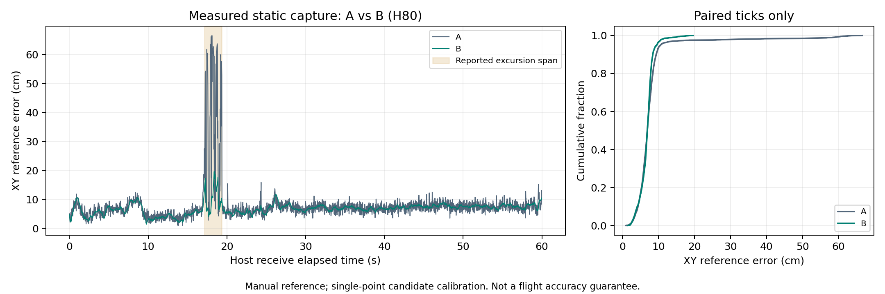

# B H80 구현과 A 비교 기록

실측 1분 로그의 A/B 비교 기록이다. B의 완료 범위와 다음 시험을 확인할 때 읽는다.

## 결론

**B 파일 실행기와 실측 정지 비교를 완료했다.**
같은 시각 2,538개에서 RMSE가 34.45% 줄었다.
A 10.71cm, B 7.02cm다.
방향 반전 합성 시험에서는 B의 오차가 더 컸다.
실운용 모델은 아직 선정하지 않았다.

| 범위 | 결과 |
|---|---|
| B 구현 | 최근 0.8초 창·네 앵커 조건·Huber 회귀 연결 |
| 실패 처리 | 표본 부족·rank·조건수·수치 실패·재부팅·시각 역행 구분 |
| 실측 비교 | 2차 정지 로그 2,540주기. A와 같은 입력·편향 |
| 합성 비교 | 등속·잡음·튐·지속 편향·방향 반전·단절 |
| 검증 | UWB pytest 86개·패키지 빌드·CLI·재생 일치 |
| 외부 전달 | 파일 출력만 사용. 기존 전달 설정 변경 없음 |
| 당시 남은 일 | C 구현·동적 실측·다점 교정·동시 ToF 연동 |

## 입력과 비교 조건

A의 교정 결과를 잠그고 B를 계산했다.
평가 로그에서 편향이나 H80 설정을 다시 맞추지 않았다.
이 로그는 이미 살펴본 개발 평가 자료다.
최종 독립 평가 자료로 표시하지 않는다.

| 항목 | 사용한 값·근거 |
|---|---|
| 평가 RAW | `data/raw/uwb/uwb_static_20260906_170938/received.jsonl` |
| 교정 RAW | `data/raw/uwb/uwb_static_20260906_161636/received.jsonl` |
| 편향 후보 m | `[-0.144754882, +0.198234544, -0.175438002, -0.059136635]` |
| 보정식 | `r_cal[i] = raw_slant[i] - bias[i]` |
| 앵커 지도 | `src/drone_uwb/config/anchors_20260906.json` |
| 평가 기준점 m | 당시 수기 기록 `(2.09, 1.68, 1.19)` |
| A | 기존 네 앵커 동일 가중 거리 풀이 |
| B | `reference_slant`·동일 높이의 앵커 배치 전제 |
| 높이 사용 | A는 당시 안테나 높이 기록 사용. B 회귀는 별도 높이 입력 없음 |
| 추가 기능 | 거리·위치 게이트, Q_S10, 앵커 제외 미적용 |

편향은 한 지점에서 구한 후보값이다.
기준점·앵커 배치의 오차도 섞일 수 있다.
기준점은 독립 측량으로 검증하지 않았다.
ZIP의 다른 태그에 대한 편향값을 사용하지 않았다.

## 구현과 적용값

계산부는 `processing/`에 두었다.
수신 원본은 바꾸지 않았다.

```text
RAW 기록 → 수신 계약 검사 → RAW - 잠근 편향
                               ├─ A 동일 가중 풀이
                               └─ B 최근 0.8초 창 → H80
                                      ↓
                     같은 수신 주기의 결과·실패 기록
                                      ↓
                     기준점 대비 오차·가용률·시간 평가
```

| 코드 | 역할 |
|---|---|
| `processing/h80.py` | SVD·Huber 회귀, rank·수치 실패 검사 |
| `processing/experiments/h80_b.py` | 창·파일 재생·A/B 평가·해시 기록 |
| `tools/benchmark_h80_b.py` | 여섯 합성 시나리오와 비교 그림 |
| `config/h80_b_static_20260906.json` | 입력 해시·잠근 교정·A/B 설정 |

| B 설정 | 적용값 |
|---|---:|
| 최대 창 | 0.8s |
| 앵커별 최소 표본 / 전체 최소 | 3 / 12 |
| 필요한 앵커 | 4 |
| 거리 표준편차 가정 | 0.08m |
| Huber 기준 | 0.12m |
| 반복 상한 | 8 |
| 스케일 적용 조건수 상한 | 1,000,000 |
| 창 초기화 단절 | 0.15s 초과 |
| 최신 새 표본부터 계산 시각까지 허용 간격 | 0.04s |
| 입력·보정 거리 범위 | 0m 초과, 80m 이하 |

위 값은 이번 비교 설정이다. 운용 최적값은 아니다.
계산 시각은 수신 주기의 `cycle_end_us`다.
그 시각까지 도착한 표본만 사용한다.
앵커 표본 시각은 Report 읽기 시각이다.
하드웨어 레인징 시각과의 차이는 미검증이다.

이 기록은 시작 부분에 status가 없을 수 있다.
파일 전체의 세션 메타데이터를 먼저 확인한다.
이후 거리 값은 수신 순서대로 처리한다.
미래 거리·평가 XY를 회귀에 넣지 않는다.
재부팅과 시각 역행에서는 과거 창을 폐기한다.
유효 거리가 끊긴 구간도 복귀 시 창을 초기화한다.
새 거리가 없으면 과거 위치를 새 출력으로 세지 않는다.

회귀 잔차와 현재 네 거리의 기하 잔차를 구분한다.
후자는 당시 안테나 높이로 계산한 진단이다.
B 회귀나 수용 판정에는 되먹이지 않는다.
8회 이내 가중치 수렴에 도달하지 않은 출력은 131개다.
유한값·rank·조건수가 성립하면 출력한다.
이는 반복 상한을 둔 이번 모델의 정책이다.
각 출력의 `converged`로 별도 기록했다.

## 실측 결과

**같은 시각에 두 모델이 모두 계산한 결과를 비교했다.**
실패 주기를 포함한 가용률은 별도 분모로 계산했다.

| 지표 | A | B |
|---|---:|---:|
| 공통 비교 개수 | 2,538 | 2,538 |
| RMSE | 10.71cm | 7.02cm |
| 중앙 오차 | 6.87cm | 6.89cm |
| p95 오차 | 10.62cm | 9.53cm |
| 최대 오차 | 66.56cm | 19.63cm |
| 전체 2,540주기 중 출력 | 2,540 | 2,538 |
| 가용률 | 100% | 99.9213% |

중앙 오차는 개선되지 않았다.
큰 튐 감소가 전체 RMSE 개선에 기여했다.
B의 두 실패는 시작 시 표본 부족이다.
첫 출력은 첫 수신 후 약 0.045초였다.
0.8초가 지난 공통 2,506개에서도 RMSE가 줄었다.
해당 값은 A 10.75cm, B 7.03cm다.

| 기존 표시 구간 | 공통 개수 | A RMSE | B RMSE |
|---|---:|---:|---:|
| 큰 튐 표시 구간 | 95 | 42.26cm | 11.36cm |
| 표시 구간 밖 | 2,443 | 7.04cm | 6.79cm |

표시 구간은 기존 분석의 seq 246475~246569다.
구간 밖을 확인된 LOS로 부르지 않는다.
태그의 다른 위치·비행에서 7cm를 보장하지 않는다.



## 합성 이동·실패 시험

합성 결과는 센서 동기화·비행 검증과 구분한다.
각 시나리오는 8초·40Hz다. 난수 seed는 7이다.
A에는 표본별 시뮬레이터 높이를 제공했다.
등속 입력은 무잡음이다.
방향 반전의 거리 잡음은 0.02m다.
나머지 거리 잡음은 0.03m다.

| 시나리오 | A RMSE | B RMSE | 관찰 |
|---|---:|---:|---|
| 무잡음 등속 | 0.25cm | 1µm 미만 | B의 위치·속도 단위 확인 |
| XY 정지·잡음 | 2.99cm | 1.24cm | 산포 감소 |
| A2 단발 +0.60m | 8.34cm | 1.23cm | 단발 튐 영향 감소 |
| A2 지속 +0.35m | 14.28cm | 11.25cm | 편향이 남음 |
| 4초 지점 방향 반전 | 2.04cm | 3.03cm | B가 불리함 |
| 10주기 누락 | 2.90cm | 1.22cm | 복귀 후 0.05초에 B 재출력 |

A는 한 주기 동안 XY가 같다고 근사한다.
앵커별 표본 시각이 달라 무잡음 이동에도 오차가 있다.
B는 각 표본 시각의 이동을 모형에 포함한다.
등속 결과만으로 다른 이동에서도 우수하다고 판단하지 않는다.

반전 후 0.8초 구간의 RMSE는 A 2.10cm, B 9.28cm다.
B의 추정 x속도 부호 전환은 반전 후 0.42초였다.
이는 해당 합성 시험에서 정의한 응답 지표다.
통신·비행제어를 포함한 전체 지연이 아니다.
누락 시험 가용률은 A 96.875%, B 95.625%다.
분모 320에는 누락한 10주기도 포함한다.

## 확인 결과와 재실행

위치·판정 파일의 재생 일치를 확인했다.
시간 측정은 재현성 비교에서 제외했다.

| 검사 | 결과 |
|---|---|
| UWB 패키지 pytest | 86개 통과 |
| symlink 빌드·설치 CLI | 통과 |
| 두 번 재생 | results.jsonl·summary.json·positions.csv 바이트 일치 |
| 기존 A 보존 | 이전 편향 적용 A 2,540개 XY와 모두 일치 |
| 원본·설정 | 입력 SHA-256 검사. 기존 원본 수정 없음 |
| 함수 시험 | 미래 표본·접두 재생·행렬 실패·시간 역행·boot·공백 검사 |

전체 검사 중 새 폴더의 상대 import 제한에 한 번 걸렸다.
절대 import로 수정한 뒤 전체 검사를 통과했다.

| 함수 경과시간 | A | B |
|---|---:|---:|
| 중앙값 | 1.34ms | 1.61ms |
| p95 | 1.55ms | 3.32ms |
| 최대 | 5.35ms | 76.64ms |

이 값은 로컬 재생 중 측정한 함수 경과시간이다.
운영체제 스케줄링의 영향도 포함한다.
최대값은 40Hz 주기보다 길다.
실시간 마감 보장과 전체 관측 지연은 미검증이다.

```bash
cd /home/pgyxn/github/ROS2
PYTHONPATH=src/drone_uwb python -m drone_uwb.processing.experiments.h80_b \
  --config src/drone_uwb/config/h80_b_static_20260906.json \
  --root . --output /tmp/uwb_h80_b_new_run
PYTHONPATH=src/drone_uwb python src/drone_uwb/tools/benchmark_h80_b.py \
  --run-dir /tmp/uwb_h80_b_new_run --output /tmp/uwb_h80_b_new_checks
PYTHONPATH=src/drone_uwb python -m pytest src/drone_uwb/test -q
```

출력 폴더는 매번 새 경로를 지정한다.
원본 해시·설정·코드 해시는 manifest에 남는다.
실행 원본은 `/home/pgyxn/uwb_pipeline_runs/20260927_h80_b_verified`다.
재생 대조는 `20260927_h80_b_replay`다.
빌드는 `/tmp/uwb_h80_b_20260927`에 분리했다.

보관 결과는 [summary](../../data/processed/uwb/h80_b_20260927/summary.json),
[검증](../../data/processed/uwb/h80_b_20260927/verification.json),
[합성 결과](../../data/processed/uwb/h80_b_20260927/synthetic_summary.json)에 있다.
그림은 [PDF](../../data/processed/uwb/h80_b_20260927/h80_b_comparison.pdf)로도 보관했다.

## 남은 작업

다음 비교 후보는 C의 세 앵커 네 조합이다.
입력·편향·기준점은 이번 A/B 조건을 재사용한다.
동적 실측·다점 교정·ToF 시간 정렬은 미실시다.
기체 회전·장착 오프셋 검증도 남아 있다.
Q_S10과 추가 게이트는 후속 독립 비교 대상이다.

같은 날 후속으로 [C/D 구현·비교](uwb_subsets_cd_20260927.md)를 완료했다.
위 본문은 B 완료 시점의 시험 기록으로 보존한다.
실물·SITL 전달과 비행 시험은 이번 작업에 포함하지 않았다.

후속 27일 ULog는 [센서 입력 준비](uwb_flight_inputs_20260927.md)에 반영했다.
같은 비행의 UWB RAW는 없다는 사용자 확인을 받았다.
위 A/B 결과는 기존 정지 UWB 자료의 결과로 유지한다.
폴더 정리 후에도 위치·판정·지표의 바이트 일치를 확인했다.


## 기능별 커밋 전 통합 확인

2026-09-27 최종 작업본으로 UWB 테스트 142개를 통과했다.
전체 5개 패키지 빌드와 새 CLI 두 개도 확인했다.
이전 시험 수치와 당시 검증 기록은 보존했다.
이번 실기·Gazebo 실행 검증은 미실시다.
[통합 확인 기록](uwb_commit_review_20260927.md)을 따른다.
