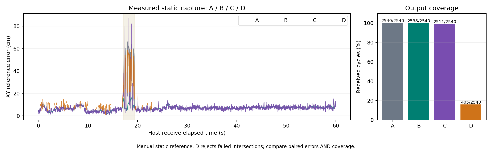

# C·D 구현과 A/B 비교 — 2026-09-27

세 앵커 조합 C와 교점 방식 D의 시험 기록이다. 구현 범위와 모델 선택 근거를 확인할 때 읽는다.

## 결과와 완료 범위

**C와 D의 첫 파일 계산·비교를 완료했다.**
이번 정지 로그에서 B를 대체할 근거는 찾지 못했다.
비행용 모델 선정은 아직 하지 않았다.

| 항목 | 완료한 범위 |
|---|---|
| C `uniform4` | 세 앵커 네 조합을 풀고 네 위치를 균등 평균 |
| D `strict_uniform4` | 교점 선택 12슬롯 → 묶음 평균 네 개 → 균등 평균 |
| 공통 실행기 | 같은 입력으로 A/B/C/D 계산·실패·가용률 기록 |
| 정지 실측 | 9월 6일 두 번째 1분 기록 2,540주기 |
| 합성 시험 | 이동·잡음·스파이크·지속 편향·반전·단절 |
| 검증 | pytest 117개, 패키지 빌드, CLI, 재생 일치 |
| A/B 회귀 | 이전 결과의 위치·상태·진단을 전부 동일하게 보존 |
| 비행 연결 | 미실시. 파일 출력만 사용 |

27일 ULog는 [센서 입력 준비](uwb_flight_inputs_20260927.md) 자료다.
사용자는 같은 비행의 UWB RAW가 없다고 확인했다.
이번 정지 UWB와 27일 ULog를 동시 자료로 결합하지 않았다.

## 구현 구조와 설정

후보 계산·결합·파일 실행을 별도 모듈로 나눴다.
위치 기준값은 계산 뒤 평가에만 사용한다.

```text
수신 검사 → RAW - 잠근 편향 → 같은 거리·지도·시각
                               ├─ A: 네 거리 풀이
                               ├─ B: 0.8초 이력 회귀
                               ├─ C: 세 거리 풀이 × 네 조합
                               │     → 네 후보 평균
                               └─ D: 수평 거리 투영
                                     → 여섯 고유 앵커 쌍의 교점
                                     → 세 번째 거리로 선택 × 12슬롯
                                     → 세 점 평균 × 네 조합
                                     → 네 후보 평균
                               ↓
                       같은 시각 오차·전체 가용률
```

C는 세 거리의 잔차 제곱합을 최소화한다.
그 결과인 네 위치를 평균한다.
D는 묶음 안의 세 점부터 평균한다.
각 묶음의 점 수가 같으므로 최종값은 12점 평균과 같다.
이 슬롯들은 원본 거리를 공유한다.
12개의 독립 측정으로 해석하지 않는다.

| 코드 | 책임 |
|---|---|
| `processing/range_solver.py` | A/C 공통 거리 풀이. A의 네 입력 계약 유지 |
| `processing/triplets.py` | S123·S124·S134·S234 계산과 남은 앵커 잔차 |
| `processing/intersections.py` | 투영·원 교점·세 번째 거리 선택·실패 슬롯 보존 |
| `processing/candidate_fusion.py` | 같은 시각·필수 ID 확인, 평균·가중치·산포 |
| `processing/experiments/subset_comparison.py` | 해시 검사·파일 계산·평가·A/B 보존 검사 |
| `tools/benchmark_subsets.py` | 동일한 여섯 합성 시나리오와 비교 그림 |

| 적용값 | 이번 시험 설정 |
|---|---|
| C 반복·수렴·조건수 | 40회 / 1e-7m / 1e6. A와 동일 |
| C 결합 | 네 후보 모두 성공해야 출력. 가중치 각 0.25 |
| D 교점 정책 | `strict`. 반지름 확장 없음 |
| D 선택 동률 폭 | 1e-6m. 동률이면 모호 상태로 보류 |
| D 최소 수평 거리 | 1e-4m |
| D 수치 허용오차 | 1e-10m². 반올림 오차 정리만 허용 |
| D 최소 중심 간격 | 1e-6m |
| D 결합 | 묶음마다 세 슬롯, 최종 네 묶음 모두 필요 |
| 추가 거리·위치 게이트 | 이번 비교에 미적용 |
| 실패 대체 | A나 과거 위치로 대체하지 않음 |
| 후보 산포 | `covariance_kind=unknown`. 위치 오차 공분산 아님 |

[설정 파일](../../src/drone_uwb/config/subsets_cd_static_20260906.json)에 값을 보존했다.
이 값들은 첫 비교 조건이다. 검증된 운용값은 아니다.
반지름 확장·품질 가중은 별도 비교 대상으로 남았다.

## 입력과 평가 조건

B와 같은 교정·평가 파일 및 기준점을 사용했다.
편향을 평가 파일에서 다시 맞추지 않았다.

| 자료 | 적용 내용 |
|---|---|
| 교정 RAW | `uwb_static_20260906_161636/received.jsonl` |
| 평가 RAW | `uwb_static_20260906_170938/received.jsonl` |
| 지도 | `anchors_20260906.json`. 수기 측량 기록 기반 |
| 평가 기준 XYZ | `[2.09, 1.68, 1.19]m`. 독립 측량 미확인 |
| C/D 높이 출처 | 당시 정지 시험의 수기 기록 |
| 편향 m | `[-0.144755, +0.198235, -0.175438, -0.059137]` |
| 보고된 거리 변화 구간 | seq 246475~246569, 95주기 |

해시는 [실행 manifest](../../data/processed/uwb/subsets_cd_20260927/manifest.json)에 있다.
단일 지점 교정 후보를 쓴 개발 평가다.
새 위치나 비행의 정확도 보장 자료가 아니다.
보고된 구간 밖을 확인된 LOS로 표시하지 않는다.

## 실측 비교 결과

모델 비교는 양쪽 모두 출력한 같은 시각에서 한다.
실패는 전체 가용률에 포함한다.

| 비교 | 공통 시각 수 | 앞 모델 RMSE cm | 뒤 모델 RMSE cm | 앞/뒤 p95 cm |
|---|---:|---:|---:|---:|
| A / B | 2,538 | 10.71 | 7.02 | 10.62 / 9.53 |
| A / C | 2,511 | 8.71 | 9.11 | 10.07 / 10.03 |
| A / D | 405 | 21.27 | 20.07 | 59.54 / 52.87 |
| B / C | 2,509 | 6.95 | 9.11 | 9.23 / 10.03 |
| B / D | 405 | 7.29 | 20.07 | 14.64 / 52.87 |

C의 RMSE는 같은 시각 A보다 약 4.5% 컸다.
D는 같은 시각 A보다 작지만 출력 누락이 많았다.
같은 시각 B와 비교하면 C와 D 모두 더 컸다.

| 모델 | 출력 수 / 2,540 | 가용률 | 자체 출력 RMSE cm | 최대 오차 cm |
|---|---:|---:|---:|---:|
| A | 2,540 | 100.00% | 10.70 | 66.56 |
| B | 2,538 | 99.92% | 7.02 | 19.63 |
| C | 2,511 | 98.86% | 9.11 | 87.12 |
| D | 405 | 15.94% | 20.07 | 61.21 |

위 표의 자체 출력 RMSE는 서로 다른 표본 집합이다.
A 전체 10.70cm와 C 9.11cm로 개선을 주장하지 않는다.
C가 출력하지 못한 큰 오차 시각이 빠지기 때문이다.

자체 유효 출력의 평균 편차·표준편차도 남긴다.

| 모델 | 평균 편차 X/Y cm | 표준편차 X/Y cm |
|---|---:|---:|
| A | -2.09 / +5.11 | 6.69 / 6.27 |
| B | -1.12 / +5.77 | 2.90 / 2.51 |
| C | -1.50 / +5.34 | 4.47 / 5.68 |
| D | -7.63 / +1.45 | 11.87 / 14.20 |

네 모델이 모두 출력한 시각은 376개다.
이때 RMSE는 A/B/C/D = 14.84/6.84/16.64/14.79cm다.
구간별 결과와 각 비교의 표본 수는
[summary.json](../../data/processed/uwb/subsets_cd_20260927/summary.json)에 보존했다.

## 출력 실패 원인

C는 29주기에서 S124 풀이가 반복 상한에 도달했다.
모두 보고된 거리 변화 구간에 있었다.
성공한 세 후보만 평균내지 않고 결합을 보류했다.

D는 2,135주기에서 A1–A4 원이 만나지 않았다.
같은 쌍이 두 묶음에 쓰여 실패 슬롯은 4,270개다.
이를 서로 다른 4,270회 수신 실패로 세지 않는다.

```text
교점 여유 = h_A1 + h_A4 - 두 앵커의 수평 간격
실패 2,135주기의 여유:
  최소 -0.268330m / 중앙 -0.089166m / 최대 -0.000195m
```

음수는 두 원이 떨어져 있다는 뜻이다.
허용오차만 조정해 해결할 반올림 수준이 아니었다.
교점이 성립한다는 사실도 정확도를 보장하지 않는다.
오염된 거리에서 교점이 생길 수도 있기 때문이다.
[실패 진단](../../data/processed/uwb/subsets_cd_20260927/failure_diagnostics.json)에 근거를 남겼다.

## 합성 이동·고장 시험

C는 이번 합성 시험에서 A와 비슷한 오차를 냈다.
D는 비동기 이동 입력에서 출력 누락이 나타났다.
각 시나리오는 8초·40Hz·seed 7이다.
높이는 시뮬레이터 값을 사용한다. ToF 성능 시험은 아니다.

| 시나리오 | A/C 공통 수 | A/C RMSE cm | A/D 공통 수 | A/D RMSE cm | D 가용률 |
|---|---:|---:|---:|---:|---:|
| 무잡음 직선 이동 | 320 | 0.250 / 0.251 | 286 | 0.248 / 0.388 | 89.38% |
| 정지 잡음 | 320 | 2.983 / 2.979 | 320 | 2.983 / 3.009 | 100.00% |
| A2 스파이크 | 320 | 8.316 / 8.290 | 320 | 8.316 / 7.513 | 100.00% |
| A2 지속 편향 | 320 | 14.234 / 14.032 | 320 | 14.234 / 12.464 | 100.00% |
| 방향 반전 | 320 | 2.039 / 2.039 | 245 | 2.033 / 2.986 | 76.56% |
| 10주기 단절 | 310 | 2.902 / 2.903 | 231 | 2.862 / 3.819 | 72.19% |

앵커 표본 시각은 주기 안에서 4ms씩 다르다.
A/C/D는 해당 주기의 XY가 같다고 근사한다.
무잡음 이동에서도 이 차이로 원이 만나지 않을 수 있다.
무잡음 정지 단위 시험에서는 12슬롯이 모두 성립했다.
자세한 주입값·결과는
[합성 요약](../../data/processed/uwb/subsets_cd_20260927/synthetic_summary.json)에 있다.



그림의 끊긴 부분은 출력 실패다.
[PDF 그림](../../data/processed/uwb/subsets_cd_20260927/subsets_comparison.pdf)도 보존했다.

## 검증과 재생

코드·입력·출력 해시와 재생 일치를 확인했다.

| 검사 | 결과 |
|---|---|
| UWB 전체 pytest | 117 passed. 새 C/D 관련 28개 포함 |
| 조합·기하 | 24순열, 무잡음 정지, 앵커 편향, 퇴화 배치 확인 |
| D 분기 | 교차·접선·분리·포함·중심 중복·선택 동률 확인 |
| 입력·결합 | 높이 누락·거리 오류·중복 ID·과거 후보 거부 |
| 공통 실행기 | 입력 해시·교정 분리·비교 표본 수·기준선 변경 거부 |
| 패키지 빌드 | 임시 build/install 경로에서 성공 |
| 설치 CLI | `ros2 run drone_uwb uwb_subset_compare --help` 성공 |
| 두 번 실측 재생 | results·positions·summary 바이트 일치 |
| 이전 A/B 결과 대조 | 전체 2,540주기의 모델 기록 일치 |
| 비행·SITL·실시간 출력 | 미실시 |

[검증 기록](../../data/processed/uwb/subsets_cd_20260927/verification.json)에 명령과 해시가 있다.
아래 명령은 저장소 루트에서 새 출력 경로로 실행한다.

```bash
PYTHONPATH=src/drone_uwb python -m drone_uwb.processing.experiments.subset_comparison \
  --config src/drone_uwb/config/subsets_cd_static_20260906.json \
  --root . --output /tmp/uwb_cd_new_run
```

계산 경과시간은 좌표 파일과 별도로 기록했다.
C의 중앙/p95/최대는 6.67/7.41/264.42ms다.
D는 2.25/2.88/319.18ms다.
이는 작업 호스트에서 관찰한 경과시간이다.
스케줄링 지연을 포함하며 실시간 성능 보장이 아니다.

## 남은 비교

이번 결과로 임의 가중치나 반지름 확장을 채택하지 않는다.
후속 변형은 이름과 설정을 분리해 비교한다.

| 남은 작업 | 필요한 근거 |
|---|---|
| D 반지름 확장 | 거리 불확실성과 확장 상한을 먼저 정한 별도 시험 |
| 후보 품질 가중·일부 결합 | 공유 관측 영향·가용률·오차를 함께 비교 |
| 전체 편향 주입 행렬 | 앵커별 여러 크기·두 앵커 이상 오염은 미실시 |
| 동적 실측 A/B/C/D | 동시 UWB·ToF·자세·시계 대응·장착 확인 |
| 최종 모델 선정 | 독립 위치·이동 기준값, 지연·정지·반전 평가 |

이번 C/D 구현은 실운용 경로에 연결하지 않았다.
PX4의 비행 추정·제어 역할도 유지한다.

같은 날 후속 요청으로 합성 시뮬레이터를 다시 실행했다.
[시뮬레이션 기록](uwb_cd_simulation_20260927.md)에 경로·오차 그림을 추가했다.
동일 seed의 재현 확인이며 새 독립 표본 시험은 아니다.


## 기능별 커밋 전 통합 확인

2026-09-27 최종 작업본으로 UWB 테스트 142개를 통과했다.
전체 5개 패키지 빌드와 새 CLI 두 개도 확인했다.
이전 시험 수치와 당시 검증 기록은 보존했다.
이번 실기·Gazebo 실행 검증은 미실시다.
[통합 확인 기록](uwb_commit_review_20260927.md)을 따른다.
